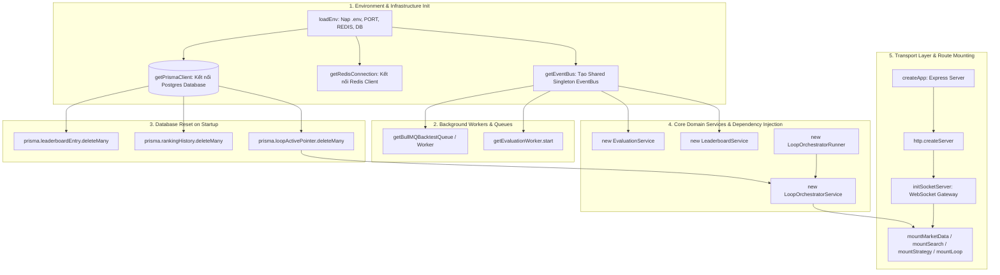

# Đặc tả Kiến trúc Chi tiết 4 Module Core & Tiến trình Build Hệ thống
## News Crawler, Sentiment Analysis, Strategy Evaluation, Leaderboard & Continuous Loop

> **Hệ thống Crypto Strategy Lab – Đồ án Software Architecture (Kiến trúc Phần mềm)**
> 
> *Tài liệu đặc tả kỹ thuật toàn diện về cấu trúc build, sơ đồ phân rã module, ánh xạ hàm/file chi tiết, các mẫu thiết kế (Design Patterns) và các phân tích đánh đổi (Trade-offs).*

---

## 📋 Mục lục

1. [Đặc tả Tiến trình Build & Boot Server (System Bootstrapping)](#1-đặc-tả-tiến-trình-build--boot-server-system-bootstrapping)
2. [Module 1 – News Crawler & Extraction Engine](#2-module-1--news-crawler--extraction-engine)
   - [2.1 Architectural Patterns & Quy tắc thiết kế](#21-architectural-patterns--quy-tắc-thiết-kế)
   - [2.2 Đáp ứng Functional & Non-Functional Requirements](#22-đáp-ứng-functional--non-functional-requirements)
   - [2.3 Ánh xạ Chi tiết File, Class & Hàm đảm nhận](#23-ánh-xạ-chi-tiết-file-class--hàm-đảm-nhận)
3. [Module 2 – Sentiment Analysis & Strategy Integration](#3-module-2--sentiment-analysis--strategy-integration)
   - [3.1 Architectural Patterns & Quy tắc thiết kế](#31-architectural-patterns--quy-tắc-thiết-kế)
   - [3.2 Đáp ứng Functional & Non-Functional Requirements](#32-đáp-ứng-functional--non-functional-requirements)
   - [3.3 Ánh xạ Chi tiết File, Class & Hàm đảm nhận](#33-ánh-xạ-chi-tiết-file-class--hàm-đảm-nhận)
4. [Module 3 – Strategy Evaluation Engine](#4-module-3--strategy-evaluation-engine)
   - [4.1 Architectural Patterns & Quy tắc thiết kế](#41-architectural-patterns--quy-tắc-thiết-kế)
   - [4.2 Đáp ứng Functional & Non-Functional Requirements](#42-đáp-ứng-functional--non-functional-requirements)
   - [4.3 Ánh xạ Chi tiết File, Class & Hàm đảm nhận](#43-ánh-xạ-chi-tiết-file-class--hàm-đảm-nhận)
5. [Module 4 – Leaderboard & Continuous Strategy Loop](#5-module-4--leaderboard--continuous-strategy-loop)
   - [5.1 Architectural Patterns & Quy tắc thiết kế](#51-architectural-patterns--quy-tắc-thiết-kế)
   - [5.2 Đáp ứng Functional & Non-Functional Requirements](#52-đáp-ứng-functional--non-functional-requirements)
   - [5.3 Ánh xạ Chi tiết File, Class & Hàm đảm nhận](#53-ánh-xạ-chi-tiết-file-class--hàm-đảm-nhận)
6. [Phân tích Đánh đổi Kiến trúc (Trade-off Matrix)](#6-phân-tích-đánh-đổi-kiến-trúc-trade-off-matrix)
7. [Luồng Vận hành Thực tế (End-to-End Practical Execution Flow)](#7-luồng-vận-hành-thực-tế-end-to-end-practical-execution-flow)

---

## 1. Đặc tả Tiến trình Build & Boot Server (System Bootstrapping)

Hệ thống **Crypto Strategy Lab** được thiết kế theo nguyên lý **Modular Monolith** kết hợp kiến trúc **Event-Driven Architecture (EDA)** và **Clean Architecture (Dependency Inversion)**. 

### 1.1 Sơ đồ Khởi tạo & Dựng Hệ thống (Startup Topology)



### 1.2 Chi tiết Các Bước Bootstrapping trong [`backend/src/server.ts`](file:///e:/Documents/HCMUS/Semester3_Year3/Kiến%20trúc%20phần%20mềm/crypto-strategy-lab/backend/src/server.ts)

| Thứ tự | Hàm / Phương thức | File Nguồn | Nhiệm vụ Kỹ thuật |
| :---: | :--- | :--- | :--- |
| **1** | `loadEnv()` | [`src/config/env.ts`](file:///e:/Documents/HCMUS/Semester3_Year3/Kiến%20trúc%20phần%20mềm/crypto-strategy-lab/backend/src/config/env.ts) | Đọc & Validate các biến môi trường qua `zod` (`DATABASE_URL`, `REDIS_HOST`, `GEMINI_API_KEY`, `PORT`). |
| **2** | `getEventBus()` | [`src/shared/event-bus/EventBus.ts`](file:///e:/Documents/HCMUS/Semester3_Year3/Kiến%20trúc%20phần%20mềm/crypto-strategy-lab/backend/src/shared/event-bus/EventBus.ts) | Khởi tạo In-Memory EventBus Singleton quản lý Publisher/Subscriber bất đồng bộ. |
| **3** | `getRedisConnection()` | [`src/infrastructure/queue/redis.ts`](file:///e:/Documents/HCMUS/Semester3_Year3/Kiến%20trúc%20phần%20mềm/crypto-strategy-lab/backend/src/infrastructure/queue/redis.ts) | Mở kết nối ioredis tới Redis server (`localhost:6379`) phục vụ BullMQ Queues. |
| **4** | `getBullMQBacktestWorker()` | [`src/modules/backtest/infrastructure/BullMQBacktestWorker.ts`](file:///e:/Documents/HCMUS/Semester3_Year3/Kiến%20trúc%20phần%20mềm/crypto-strategy-lab/backend/src/modules/backtest/infrastructure/BullMQBacktestWorker.ts) | Kích hoạt Worker lắng nghe hàng đợi `backtest` để thực thi mô phỏng khớp nến. |
| **5** | `getEvaluationWorker().start()` | [`src/modules/evaluation/infrastructure/evaluation.worker.ts`](file:///e:/Documents/HCMUS/Semester3_Year3/Kiến%20trúc%20phần%20mềm/crypto-strategy-lab/backend/src/modules/evaluation/infrastructure/evaluation.worker.ts) | Kích hoạt Worker lắng nghe hàng đợi `evaluation` để tính toán 12 chỉ số định lượng. |
| **6** | **Reset DB on Startup** | [`src/server.ts`](file:///e:/Documents/HCMUS/Semester3_Year3/Kiến%20trúc%20phần%20mềm/crypto-strategy-lab/backend/src/server.ts#L55-L58) | Thực thi `prisma.leaderboardEntry.deleteMany()`, `rankingHistory.deleteMany()`, `loopActivePointer.deleteMany()` để dọn dẹp các bản ghi cũ từ phiên chạy trước, giúp Leaderboard khởi động ở trạng thái **trống (`[]`)** sạch sẽ. |
| **7** | `new LeaderboardService()` | [`src/modules/leaderboard/application/leaderboard.service.ts`](file:///e:/Documents/HCMUS/Semester3_Year3/Kiến%20trúc%20phần%20mềm/crypto-strategy-lab/backend/src/modules/leaderboard/application/leaderboard.service.ts) | Đăng ký EventBus lắng nghe `StrategyEvaluated` để tính toán thứ hạng & đẩy Socket.IO. |
| **8** | `new LoopOrchestratorService()` | [`src/modules/leaderboard/application/loop-orchestrator.service.ts`](file:///e:/Documents/HCMUS/Semester3_Year3/Kiến%20trúc%20phần%20mềm/crypto-strategy-lab/backend/src/modules/leaderboard/application/loop-orchestrator.service.ts) | Quản lý state của Continuous Loop, kiểm tra điều kiện dừng (`maxIterations`, `maxCandidates`, `noImprovementCap`). |
| **9** | `new LoopOrchestratorRunner()` | [`src/modules/leaderboard/application/loop-orchestrator-runner.ts`](file:///e:/Documents/HCMUS/Semester3_Year3/Kiến%20trúc%20phần%20mềm/crypto-strategy-lab/backend/src/modules/leaderboard/application/loop-orchestrator-runner.ts) | Liên kết với `LoopMutationGenerator` để sinh Candidate thế hệ tiếp theo (Mutation / Crossover / Exploration). |
| **10** | `initSocketServer(httpServer)` | [`src/infrastructure/websocket/socket.ts`](file:///e:/Documents/HCMUS/Semester3_Year3/Kiến%20trúc%20phần%20mềm/crypto-strategy-lab/backend/src/infrastructure/websocket/socket.ts) | Khởi tạo Socket.IO server phát event `LeaderboardUpdated`, `NewsCollected`, `MarketDataStream` cho Frontend. |

---

## 2. Module 1 – News Crawler & Extraction Engine

### 2.1 Architectural Patterns & Quy tắc thiết kế
1. **Provider Adapter Pattern**: Trích xuất dữ liệu tin tức qua `NewsProviderAdapter` interface. Cho phép thêm nguồn tin mới (như CoinDesk, CoinTelegraph) mà **không sửa đổi `NewsService`**.
2. **Transactional Outbox Pattern**: Lưu bài báo vào DB và tạo `QueueJob` trong cùng 1 database transaction. Tránh việc phát event tin tức mồ côi khi DB lưu thất bại.
3. **LLM Template & Self-Healing Pattern**: Dùng Gemini AI để tự động phát sinh CSS Selectors cho website tin tức và kích hoạt tự sửa lỗi (**Self-healing**) khi tỷ lệ rỗng DOM $> 10\%$.

### 2.2 Đáp ứng Requirements (FRs & NFRs)
- **FR-050 $\rightarrow$ FR-055**: Thu thập tin tức, chuẩn hóa `NewsItem`, lưu PostgreSQL và hiển thị lên giao diện News Crawler.
- **NFR-004 (News Extensibility)**: Mở rộng nguồn crawler mới với thay đổi tối thiểu.
- **NFR-019 (News Failure Isolation)**: Lỗi cào tin không ảnh hưởng đến luồng Backtest hay Strategy Engine.

### 2.3 Ánh xạ Chi tiết File, Class & Hàm đảm nhận

```
backend/src/modules/news/
├── domain/
│   ├── news.entity.ts                  # Interface: NewsItem, NewsProviderAdapter, NewsRepository
│   └── extraction.entity.ts            # Interface: ExtractionTemplateEntity, QualityValidationResult
├── infrastructure/
│   ├── crypto-panic.adapter.ts         # Class: CryptoPanicAdapter (Crawl REST API)
│   ├── html-news.adapter.ts            # Class: HtmlNewsAdapter (Scrape tin bằng Cheerio + Template)
│   ├── llm-extraction.template-manager.ts # Class: LlmExtractionTemplateManager (Sinh CSS selector qua Gemini)
│   ├── self-healing.orchestrator.ts    # Class: SelfHealingOrchestrator (Giám sát lỗi DOM & auto-heal)
│   └── prisma-news.repository.ts       # Class: PrismaNewsRepository (CRUD Postgres & Outbox Transaction)
├── application/
│   └── news.service.ts                 # Class: NewsService (Điều phối crawl, lưu DB, bắn event NewsCollected)
└── presentation/
    ├── news.controller.ts              # Class: NewsController (Xử lý HTTP Request/Response)
    └── news.routes.ts                  # Function: buildNewsRouter() (Khai báo REST Endpoints)
```

#### Bảng Mô tả Hàm Chi tiết (Module 1)

| Tên File | Class / Component | Tên Hàm (Method Signature) | Đầu vào (Input) | Đầu ra (Output) | Nhiệm vụ Kỹ thuật |
| :--- | :--- | :--- | :--- | :--- | :--- |
| [`crypto-panic.adapter.ts`](file:///e:/Documents/HCMUS/Semester3_Year3/Kiến%20trúc%20phần%20mềm/crypto-strategy-lab/backend/src/modules/news/infrastructure/crypto-panic.adapter.ts) | `CryptoPanicAdapter` | `fetchNews(limit?: number)` | `limit: number` | `Promise<NewsItem[]>` | Gọi CryptoPanic REST API, parse JSON về mảng `NewsItem` chuẩn hóa. |
| [`html-news.adapter.ts`](file:///e:/Documents/HCMUS/Semester3_Year3/Kiến%20trúc%20phần%20mềm/crypto-strategy-lab/backend/src/modules/news/infrastructure/html-news.adapter.ts) | `HtmlNewsAdapter` | `extract(html: string, template: ExtractionTemplateEntity)` | `html: string, template` | `NewsItem[]` | Dùng `cheerio` load HTML, áp CSS selectors từ template để trích xuất Title, PublishedAt, Content. |
| [`llm-extraction.template-manager.ts`](file:///e:/Documents/HCMUS/Semester3_Year3/Kiến%20trúc%20phần%20mềm/crypto-strategy-lab/backend/src/modules/news/infrastructure/llm-extraction.template-manager.ts) | `LlmExtractionTemplateManager` | `generateTemplate(domain: string, sampleHtml: string)` | `domain, sampleHtml` | `Promise<ExtractionTemplateEntity>` | Gửi mẫu HTML cho Gemini Prompt, yêu cầu trả JSON chứa CSS Selectors (title, date, body), tăng version template (`v1.4.2`). |
| [`self-healing.orchestrator.ts`](file:///e:/Documents/HCMUS/Semester3_Year3/Kiến%20trúc%20phần%20mềm/crypto-strategy-lab/backend/src/modules/news/infrastructure/self-healing.orchestrator.ts) | `SelfHealingOrchestrator` | `checkQuality(items: NewsItem[])` | `items: NewsItem[]` | `QualityValidationResult` | Kiểm tra mảng tin cào được. Nếu tỷ lệ rỗng/lỗi $> 10\%$, trả về `valid: false` để trigger Self-Healing. |
| [`self-healing.orchestrator.ts`](file:///e:/Documents/HCMUS/Semester3_Year3/Kiến%20trúc%20phần%20mềm/crypto-strategy-lab/backend/src/modules/news/infrastructure/self-healing.orchestrator.ts) | `SelfHealingOrchestrator` | `triggerSelfHealing(domain: string, html: string)` | `domain, html` | `Promise<SelfHealingResult>` | Yêu cầu `TemplateManager` sinh template mới, lưu DB và khôi phục tiến trình cào tin tự động. |
| [`prisma-news.repository.ts`](file:///e:/Documents/HCMUS/Semester3_Year3/Kiến%20trúc%20phần%20mềm/crypto-strategy-lab/backend/src/modules/news/infrastructure/prisma-news.repository.ts) | `PrismaNewsRepository` | `saveNewsWithOutbox(items: NewsItem[])` | `items: NewsItem[]` | `Promise<number>` | Mở Prisma `$transaction`: `upsert` bài báo vào `NewsItem` + ghi job vào `QueueJob` (Outbox). |
| [`news.service.ts`](file:///e:/Documents/HCMUS/Semester3_Year3/Kiến%20trúc%20phần%20mềm/crypto-strategy-lab/backend/src/modules/news/application/news.service.ts) | `NewsService` | `crawlAll()` | `None` | `Promise<CrawlSummary>` | Duyệt qua các Adapters, cào tin, lưu DB qua Outbox, phát sự kiện `NewsCollected` tới EventBus và Socket.IO. |

---

## 3. Module 2 – Sentiment Analysis & Strategy Integration

### 3.1 Architectural Patterns & Quy tắc thiết kế
1. **Event-Driven Architecture (EDA)**: Tự động đăng ký lắng nghe sự kiện `NewsCollected` từ EventBus để phân tích Sentiment ngầm không gây nghẽn UI.
2. **Strategy Pattern / Plugin Architecture**: Biến kết quả Sentiment thành một chỉ báo giao dịch chuẩn thông qua class **`NewsSentimentStrategy`**, cho phép phối hợp thành Composite Strategy (`MA + RSI + News Sentiment`).
3. **In-Memory LRU Caching**: Caching dữ liệu Sentiment trong 30 giây để giảm tải truy vấn DB và chi phí gọi AI API.

### 3.2 Đáp ứng Requirements (FRs & NFRs)
- **FR-056 $\rightarrow$ FR-060**: Phân tích Sentiment thành `POSITIVE`, `NEUTRAL`, `NEGATIVE` với điểm số `score` (từ -1.0 đến +1.0).
- **NFR-005 & AC-08 (Model Extensibility)**: Thay thế model phân tích (Gemini, Lexicon, HuggingFace) bằng cách cài đặt `SentimentAnalyzer` interface.

### 3.3 Ánh xạ Chi tiết File, Class & Hàm đảm nhận

```
backend/src/
├── modules/sentiment/
│   ├── domain/
│   │   └── sentiment.entity.ts         # Interface: SentimentRecord, SentimentAnalysisResult, SentimentAnalyzer
│   ├── infrastructure/
│   │   ├── gemini-sentiment.analyzer.ts# Class: GeminiSentimentAnalyzer (Gọi Gemini REST API phân tích cảm xúc)
│   │   └── prisma-sentiment.repository.ts # Class: PrismaSentimentRepository (CRUD Postgres Sentiment)
│   ├── application/
│   │   └── sentiment.service.ts        # Class: SentimentService (Lắng nghe Event, Caching, Phân tích tin)
│   └── presentation/
│       ├── sentiment.controller.ts     # Class: SentimentController (REST API summary)
│       └── sentiment.routes.ts         # Function: buildSentimentRouter()
└── modules/strategy/strategies/
    └── NewsSentimentStrategy.ts        # Class: NewsSentimentStrategy (Triển khai Strategy interface)
```

#### Bảng Mô tả Hàm Chi tiết (Module 2)

| Tên File | Class / Component | Tên Hàm (Method Signature) | Đầu vào (Input) | Đầu ra (Output) | Nhiệm vụ Kỹ thuật |
| :--- | :--- | :--- | :--- | :--- | :--- |
| [`gemini-sentiment.analyzer.ts`](file:///e:/Documents/HCMUS/Semester3_Year3/Kiến%20trúc%20phần%20mềm/crypto-strategy-lab/backend/src/modules/sentiment/infrastructure/gemini-sentiment.analyzer.ts) | `GeminiSentimentAnalyzer` | `analyzeText(title: string, content: string)` | `title, content` | `Promise<SentimentAnalysisResult>` | Trích xuất cảm xúc qua Gemini AI API. Trả về `label` (POSITIVE/NEUTRAL/NEGATIVE), `score` (-1.0 đến +1.0) và `confidence`. |
| [`prisma-sentiment.repository.ts`](file:///e:/Documents/HCMUS/Semester3_Year3/Kiến%20trúc%20phần%20mềm/crypto-strategy-lab/backend/src/modules/sentiment/infrastructure/prisma-sentiment.repository.ts) | `PrismaSentimentRepository` | `saveSentiment(record: SentimentRecord)` | `record` | `Promise<SentimentRecord>` | Lưu kết quả Sentiment gắn với `newsItemId` vào PostgreSQL. |
| [`prisma-sentiment.repository.ts`](file:///e:/Documents/HCMUS/Semester3_Year3/Kiến%20trúc%20phần%20mềm/crypto-strategy-lab/backend/src/modules/sentiment/infrastructure/prisma-sentiment.repository.ts) | `PrismaSentimentRepository` | `getSentimentSummary(symbol?: string)` | `symbol?: string` | `Promise<SentimentSummary>` | Tính tổng số tin Positive/Neutral/Negative, trung bình điểm sentimentScore trong 24h qua. |
| [`sentiment.service.ts`](file:///e:/Documents/HCMUS/Semester3_Year3/Kiến%20trúc%20phần%20mềm/crypto-strategy-lab/backend/src/modules/sentiment/application/sentiment.service.ts) | `SentimentService` | `handleNewsCollected(payload: { newsItemIds: string[] })` | `payload` | `Promise<void>` | Subscriber bắt sự kiện `NewsCollected`, duyệt danh sách tin bài chưa phân tích và gọi `analyzer.analyzeText()`. |
| [`NewsSentimentStrategy.ts`](file:///e:/Documents/HCMUS/Semester3_Year3/Kiến%20trúc%20phần%20mềm/crypto-strategy-lab/backend/src/modules/strategy/strategies/NewsSentimentStrategy.ts) | `NewsSentimentStrategy` | `evaluateSignal(candles: CandleData[], index: number)` | `candles, index` | `"BUY" \| "SELL" \| "HOLD"` | Đọc điểm Sentiment 24h tại thời điểm cây nến. Phát tín hiệu **BUY** nếu Score $\ge +0.7$, **SELL** nếu Score $\le -0.7$, ngược lại **HOLD**. |

---

## 4. Module 3 – Strategy Evaluation Engine

### 4.1 Architectural Patterns & Quy tắc thiết kế
1. **Pure Functional Domain Engine**: `EvaluatorEngine` là một **Pure Class**, không chứa bất kỳ kết nối I/O nào (không DB, không Redis, không HTTP). Điều này đảm bảo tốc độ tính toán siêu nhanh và Unit Test đạt độ tin cậy tuyệt đối.
2. **Producer-Consumer Worker Pattern (BullMQ Queue)**: Đẩy các công việc đánh giá backtest vào hàng đợi Redis để các `EvaluationWorker` xử lý song song, chống nghẽn Event Loop của Node.js.
3. **Small Sample Penalty Mechanism**: Công thức phạt tự động $\text{Score} = \text{RawScore} \times \sqrt{\frac{N_{\text{trades}}}{30}}$ nếu số lượng giao dịch $N < 30$.

### 4.2 Đáp ứng Requirements (FRs & NFRs)
- **FR-038 $\rightarrow$ FR-043**: Đánh giá 12 chỉ số định lượng: Total Return, Win Rate, Max Drawdown, Sharpe Ratio, Sortino Ratio, Calmar Ratio, Profit Factor, Equity Curve.
- **AC-05 & AC-06**: Tách biệt hoàn toàn giữa `EvaluatorEngine` và `Backtester`.

### 4.3 Ánh xạ Chi tiết File, Class & Hàm đảm nhận

```
backend/src/modules/evaluation/
├── domain/
│   ├── evaluator.engine.ts            # Class Pure Domain: EvaluatorEngine (Thuật toán 12 chỉ số tài chính)
│   └── evaluation.entity.ts           # Interface: EvaluationResultMetrics, EvaluationWeights, TradeInput
├── infrastructure/
│   ├── evaluation.queue.ts            # Class: BullMQEvaluationQueue (Đẩy job vào Redis Queue)
│   └── evaluation.worker.ts           # Class: BullMQEvaluationWorker (Xử lý job ngầm & ghi Postgres)
└── application/
    └── evaluation.service.ts          # Class: EvaluationService (Lắng nghe BacktestCompleted & đẩy job)
```

#### Bảng Mô tả Hàm Chi tiết (Module 3)

| Tên File | Class / Component | Tên Hàm (Method Signature) | Đầu vào (Input) | Đầu ra (Output) | Nhiệm vụ Kỹ thuật |
| :--- | :--- | :--- | :--- | :--- | :--- |
| [`evaluator.engine.ts`](file:///e:/Documents/HCMUS/Semester3_Year3/Kiến%20trúc%20phần%20mềm/crypto-strategy-lab/backend/src/modules/evaluation/domain/evaluator.engine.ts) | `EvaluatorEngine` | `calculateMetrics(trades: TradeInput[], initialCapital?: number, weights?: EvaluationWeights)` | `trades[], capital, weights` | `EvaluationResultMetrics` | **Hàm lõi Pure Domain**: Duyệt danh sách giao dịch, tính toán Total Return, WinRate Laplace $\frac{N_{\text{win}}+1}{N_{\text{total}}+2}$, Sharpe, Sortino, Calmar, Profit Factor, Equity Curve và `overallScore`. |
| [`evaluator.engine.ts`](file:///e:/Documents/HCMUS/Semester3_Year3/Kiến%20trúc%20phần%20mềm/crypto-strategy-lab/backend/src/modules/evaluation/domain/evaluator.engine.ts) | `EvaluatorEngine` | `applyTradeCountPenalty(score: number, numTrades: number)` | `score, numTrades` | `number` | Tính toán hệ số phạt nếu $N_{\text{trades}} < 30$: $\text{score} \times \sqrt{N / 30}$. Giữ nguyên điểm nếu $N \ge 30$. |
| [`evaluation.queue.ts`](file:///e:/Documents/HCMUS/Semester3_Year3/Kiến%20trúc%20phần%20mềm/crypto-strategy-lab/backend/src/modules/evaluation/infrastructure/evaluation.queue.ts) | `BullMQEvaluationQueue` | `enqueueEvaluation(jobData: EvaluationJobData)` | `jobData` | `Promise<Job>` | Thêm job đánh giá vào hàng đợi Redis `evaluation` với cơ chế Idempotency dựa trên `experimentId`. |
| [`evaluation.worker.ts`](file:///e:/Documents/HCMUS/Semester3_Year3/Kiến%20trúc%20phần%20mềm/crypto-strategy-lab/backend/src/modules/evaluation/infrastructure/evaluation.worker.ts) | `BullMQEvaluationWorker` | `processJob(job: Job<EvaluationJobData>)` | `job` | `Promise<EvaluationResultMetrics>` | Lấy danh sách trades từ DB, gọi `EvaluatorEngine.calculateMetrics()`, lưu kết quả vào bảng `BacktestResult` và bắn sự kiện `StrategyEvaluated`. |
| [`evaluation.service.ts`](file:///e:/Documents/HCMUS/Semester3_Year3/Kiến%20trúc%20phần%20mềm/crypto-strategy-lab/backend/src/modules/evaluation/application/evaluation.service.ts) | `EvaluationService` | `handleBacktestCompleted(payload: { experimentId: string })` | `payload` | `Promise<void>` | Bắt sự kiện `BacktestCompleted` từ Backtest Module, kích hoạt `enqueueEvaluation()`. |

---

## 5. Module 4 – Leaderboard & Continuous Strategy Loop

### 5.1 Architectural Patterns & Quy tắc thiết kế
1. **Repository Pattern with Dynamic Sorting**: Query Top-K chiến lược linh hoạt theo `overallScore`, `totalReturn`, `winRate`, `maxDrawdown`, `sharpeRatio`.
2. **Session-Scoped & Cumulative Iteration Ranking**:
   - Bảng Leaderboard trong Continuous Loop (`/loop`) xếp hạng lũy tiến các chiến lược thuộc **chính phiên loop đó** theo từng Iteration.
   - Thẻ hiển thị (LeaderboardCard) trích xuất phần trăm trọng số (VD: `[Bollinger 60%] [RSI 40%]`) giúp phân biệt các chiến lược cùng gia đình chỉ báo.
3. **Automated Evolutionary Loop (Hybrid Mutation Generator)**:
   - Tự động lấy chiến lược Top-1 của Iteration $k$ làm **Parent** cho Iteration $k+1$.
   - Thực thi Đột biến trọng số (Mutation ~40%), Lai ghép với Elite Pool (Crossover ~20%) và Khám phá chỉ báo mới (Exploration ~40%).
4. **State Persistence & Server Session Lifecycle**:
   - **Khi khởi động Server**: Reset bảng `LeaderboardEntry`, `RankingHistory` và `LoopActivePointer` về trống (`[]`).
   - **Khi chạy Loop**: Tự động duy trì phiên Loop mới nhất và kết quả trên Leaderboard liên tục qua các thao tác chuyển trang cho đến khi tắt/bật lại server hoặc có Loop mới thay thế.

### 5.2 Đáp ứng Requirements (FRs & NFRs)
- **FR-044 $\rightarrow$ FR-049**: Hiển thị Top-K, xếp hạng, lưu vết `RankingHistory`, phát tín hiệu Socket.IO `LeaderboardUpdated`.
- **NFR-032 (Real-time Feedback)**: Đẩy cập nhật tức thì xuống màn hình người dùng qua WebSockets.

### 5.3 Ánh xạ Chi tiết File, Class & Hàm đảm nhận

```
backend/src/modules/leaderboard/
├── domain/
│   └── leaderboard.entity.ts           # Interface: LeaderboardItem, LeaderboardFilterOptions, RankingHistoryItem
├── infrastructure/
│   └── prisma-leaderboard.repository.ts# Class: PrismaLeaderboardRepository (Calculates ranks, records RankingHistory)
├── application/
│   ├── leaderboard.service.ts          # Class: LeaderboardService (Bắt StrategyEvaluated, phát LeaderboardUpdated & NewTopStrategyFound)
│   ├── loop-orchestrator.service.ts    # Class: LoopOrchestratorService (Quản lý state, stop conditions, cascade stop)
│   └── loop-orchestrator-runner.ts     # Class: LoopOrchestratorRunner (Tạo SearchRun cho Iteration N+1)
└── presentation/
    ├── leaderboard.controller.ts       # Class: LeaderboardController (GET /api/leaderboard, GET /api/leaderboard/history)
    ├── leaderboard.routes.ts           # Router: buildLeaderboardRouter()
    └── loop.routes.ts                  # Router: buildLoopRouter() (GET /api/loop/active, GET /api/loop/candidates, POST /start, POST /stop)

backend/src/modules/search/generators/
└── LoopMutationGenerator.ts            # Class: LoopMutationGenerator (Thuật toán di truyền Mutation/Crossover/Exploration)

frontend/src/
├── components/LeaderboardCard.tsx      # UI Widget: Parse weights tag pills, màu đỏ Profit âm / xanh Profit dương
├── pages/Loop.tsx                      # UI Page: Continuous Loop control, Iteration breakdown, auto-restore phiên mới nhất
└── pages/Leaderboard.tsx               # UI Page: Trang Leaderboard toàn cục All-Time với bộ lọc đa chiều
```

#### Bảng Mô tả Hàm Chi tiết (Module 4)

| Tên File | Class / Component | Tên Hàm (Method Signature) | Đầu vào (Input) | Đầu ra (Output) | Nhiệm vụ Kỹ thuật |
| :--- | :--- | :--- | :--- | :--- | :--- |
| [`prisma-leaderboard.repository.ts`](file:///e:/Documents/HCMUS/Semester3_Year3/Kiến%20trúc%20phần%20mềm/crypto-strategy-lab/backend/src/modules/leaderboard/infrastructure/prisma-leaderboard.repository.ts) | `PrismaLeaderboardRepository` | `upsertEntry(item: LeaderboardItem)` | `item` | `Promise<LeaderboardItem>` | Lưu/Cập nhật thông số chiến lược vào bảng `LeaderboardEntry` trong Database. |
| [`prisma-leaderboard.repository.ts`](file:///e:/Documents/HCMUS/Semester3_Year3/Kiến%20trúc%20phần%20mềm/crypto-strategy-lab/backend/src/modules/leaderboard/infrastructure/prisma-leaderboard.repository.ts) | `PrismaLeaderboardRepository` | `recalculateRanks(symbolId: string, timeframe: string)` | `symbolId, timeframe` | `Promise<LeaderboardItem[]>` | Tính toán lại thứ hạng Top-K dựa trên `overallScore`, ghi vết thay đổi thứ hạng vào `RankingHistory`. |
| [`leaderboard.service.ts`](file:///e:/Documents/HCMUS/Semester3_Year3/Kiến%20trúc%20phần%20mềm/crypto-strategy-lab/backend/src/modules/leaderboard/application/leaderboard.service.ts) | `LeaderboardService` | `handleStrategyEvaluated(payload: StrategyEvaluatedPayload)` | `payload` | `Promise<LeaderboardItem[]>` | Bắt sự kiện `StrategyEvaluated`, gọi `upsertEntry`, phát sự kiện `LeaderboardUpdated` qua Socket.IO và `NewTopStrategyFound` cho Loop. |
| [`loop-orchestrator.service.ts`](file:///e:/Documents/HCMUS/Semester3_Year3/Kiến%20trúc%20phần%20mềm/crypto-strategy-lab/backend/src/modules/leaderboard/application/loop-orchestrator.service.ts) | `LoopOrchestratorService` | `startLoop(config: LoopConfig)` | `config` | `Promise<void>` | Khởi tạo phiên Loop mới trong DB, thiết lập các giới hạn `maxIterations`, `maxCandidates`, `noImprovementCap`. |
| [`loop-orchestrator.service.ts`](file:///e:/Documents/HCMUS/Semester3_Year3/Kiến%20trúc%20phần%20mềm/crypto-strategy-lab/backend/src/modules/leaderboard/application/loop-orchestrator.service.ts) | `LoopOrchestratorService` | `afterIterationCompleted(loopId: string, completedIter: number, parentForNext: string \| null)` | `loopId, completedIter, parent` | `Promise<void>` | **Hàm điều phối thế hệ**: Kiểm tra điều kiện dừng. Nếu chưa dừng, tăng `currentIteration` và gọi `runner.runIteration()` để sang Iteration $N+1$. |
| [`loop-orchestrator.service.ts`](file:///e:/Documents/HCMUS/Semester3_Year3/Kiến%20trúc%20phần%20mềm/crypto-strategy-lab/backend/src/modules/leaderboard/application/loop-orchestrator.service.ts) | `LoopOrchestratorService` | `cascadeStop(loopId: string, reason: LoopStatus)` | `loopId, reason` | `Promise<void>` | Dừng phiên Loop atomicity, chuyển toàn bộ Iteration `RUNNING` thành `STOPPED` và cập nhật lý do dừng. |
| [`loop-orchestrator-runner.ts`](file:///e:/Documents/HCMUS/Semester3_Year3/Kiến%20trúc%20phần%20mềm/crypto-strategy-lab/backend/src/modules/leaderboard/application/loop-orchestrator-runner.ts) | `LoopOrchestratorRunner` | `runIteration(loopId: string, nextIter: number, parentStrategyVersionId: string)` | `loopId, nextIter, parentId` | `Promise<string \| null>` | Gọi `LoopMutationGenerator` để sinh Candidate thế hệ mới và tạo `SearchRun` tương ứng cho Iteration $N+1$. |
| [`LoopMutationGenerator.ts`](file:///e:/Documents/HCMUS/Semester3_Year3/Kiến%20trúc%20phần%20mềm/crypto-strategy-lab/backend/src/modules/search/generators/LoopMutationGenerator.ts) | `LoopMutationGenerator` | `generateCandidate(config: GeneratorConfig)` | `config` | `CandidateStrategy` | Thực thi thuật toán di truyền di chuyển: Đột biến trọng số chỉ báo, Lai ghép với Elite Pool, Khám phá chỉ báo mới (như `NewsSentiment`). |
| [`LeaderboardCard.tsx`](file:///e:/Documents/HCMUS/Semester3_Year3/Kiến%20trúc%20phần%20mềm/crypto-strategy-lab/frontend/src/components/LeaderboardCard.tsx) | `LeaderboardCard` | `parseStrategyTags(name: string)` | `name: string` | `TagConfig[]` | Regex trích xuất trọng số tín hiệu (VD: `Bollinger 60%`, `RSI 40%`) để hiển thị dạng thẻ pill trực quan. |

---

## 6. Phân tích Đánh đổi Kiến trúc (Trade-off Matrix)

| Module | Ưu điểm Kiến trúc (Architectural Gain) | Sự Đánh đổi (Trade-off) | Giải pháp Khắc phục Kỹ thuật |
| :--- | :--- | :--- | :--- |
| **Module 1: News Crawler** | **Provider Adapter Pattern**: Dễ dàng thêm nguồn cào tin mới mà không đụng vào core code. | Chi phí latency và Token API khi dùng Gemini AI sinh CSS Selector động. | Caching Template theo Version (`v1.4.2`). Chỉ gọi LLM khi khởi tạo hoặc bị Self-Healing trigger. |
| **Module 1: News Outbox** | **Transactional Outbox**: Tránh mất bài báo và event `NewsCollected` mồ côi. | Tăng dung lượng đĩa ghi PostgreSQL do duy trì bảng `QueueJob`. | Dọn dẹp định kỳ (Clean up) các job đã xong trong bảng `QueueJob`. |
| **Module 2: Sentiment** | **Event-Driven Architecture**: Crawl tin tức không bị chậm do phân tích AI chạy ngầm. | **Eventual Consistency**: Bài báo mới cào sẽ có độ trễ 1-3 giây trước khi có điểm Sentiment. | Broadcast kết quả qua Socket.IO và tự động backfill tin bài rỗng ngầm. |
| **Module 3: Evaluation** | **Pure Domain Engine**: Unit Test $100\%$ tin cậy, tính toán cực nhanh không nghẽn I/O. | Phải truyền danh sách `TradeInput[]` vào bộ nhớ RAM của BullMQ Worker. | Tối ưu hóa memory footprint của đối tượng Trade (chỉ nạp các trường định lượng số). |
| **Module 4: Loop & Leaderboard** | **Automated Evolution**: Tự động nhân giống chiến lược Top-1 sang Iteration tiếp theo. | Nguy cơ rơi vào điểm tối ưu cục bộ (Local Optima) khi lặp lại quá nhiều lần. | Áp dụng tỷ lệ **Exploration 40%** để chủ động thêm các chỉ báo hoàn toàn mới vào thế hệ sau. |

---

## 7. Luồng Vận hành Thực tế (End-to-End Practical Execution Flow)

Kịch bản kịch tính thực tế: **Cào tin tự động $\rightarrow$ Phân tích Cảm xúc bằng Gemini $\rightarrow$ Chạy Continuous Loop tiến hóa tổ hợp `MA + RSI + News Sentiment` $\rightarrow$ Đánh giá 12 chỉ số $\rightarrow$ Đẩy Bảng xếp hạng Realtime qua Socket.IO.**

```mermaid
sequenceDiagram
    autonumber
    participant NC as News Crawler Engine
    participant DB as PostgreSQL Database
    participant EB as EventBus (In-Memory)
    participant SS as Sentiment Service (Gemini AI)
    participant LOOP as Continuous Loop Orchestrator
    participant EVAL as BullMQ Evaluation Worker
    participant LB as Leaderboard Service
    participant FE as Frontend UI (/loop & /leaderboard)

    Note over NC, DB: BƯỚC 1: CÀO TIN TỨC & KIỂM TRA DOM (MODULE 1)
    NC->>NC: HtmlNewsAdapter cào bài tin "Bitcoin bứt phá mốc $100k" (Template v1.4.2)
    alt DOM bị đổi (Lỗi > 10%)
        NC->>NC: SelfHealingOrchestrator trigger Gemini khôi phục Selector (v1.4.3)
    end
    NC->>DB: Transaction: Upsert NewsItem + Ghi Outbox QueueJob
    NC->>EB: Publish Event "NewsCollected" (BTC News)

    Note over SS, DB: BƯỚC 2: PHÂN TÍCH SENTIMENT NGẦM (MODULE 2)
    EB->>SS: Subscriber nhận trigger handleNewsCollected()
    SS->>SS: Gemini API phân tích -> Sentiment Score: +0.85 (POSITIVE)
    SS->>DB: Lưu bản ghi SentimentRecord (+0.85)
    SS->>EB: Publish Event "SentimentAnalyzed"

    Note over LOOP, EVAL: BƯỚC 3: CONTINUOUS LOOP TIẾN HÓA CHIẾN LƯỢC (MODULE 1 + 3)
    LOOP->>LOOP: LoopMutationGenerator tạo Candidate tổ hợp: "MA 30% + RSI 30% + News Sentiment 40%"
    LOOP->>EVAL: Chạy Backtest nến Binance -> Đẩy Job vào BullMQ Evaluation Queue
    EVAL->>EVAL: EvaluatorEngine tính toán (Return: +32.4%, Winrate Laplace: 72.73%, OverallScore: 88.5)
    EVAL->>EB: Publish Event "StrategyEvaluated"

    Note over LB, FE: BƯỚC 4: CẬP NHẬT BẢNG XẾP HẠNG & BROADCAST REALTIME (MODULE 4)
    EB->>LB: Subscriber nhận trigger handleStrategyEvaluated()
    LB->>DB: Upsert LeaderboardEntry & Recalculate Ranks (Chiến lược vươn lên RANK #1 🥇)
    LB->>DB: Ghi vết snapshot vào bảng RankingHistory
    LB->>EB: Publish Event "NewTopStrategyFound" (Kích hoạt Iteration N+1 lấy chiến lược này làm Parent)
    LB->>FE: Socket.IO Broadcast Event "LeaderboardUpdated"
    FE->>FE: Màn hình /loop tự động nảy số & nhảy thẻ pill [MA 30%] [RSI 30%] [Sentiment 40%] lên vị trí Top 1!
```

---

### 💡 Tóm tắt Diễn biến Hệ thống Theo Thời Gian (System Timeline Walkthrough)

1. **Giây 00**: `HtmlNewsAdapter` cào bài báo mới từ nguồn tin. Nếu website đổi giao diện, `SelfHealingOrchestrator` tự phát hiện và gọi Gemini AI cập nhật template trích xuất sang `v1.4.3`.
2. **Giây 01**: Bài báo được lưu an toàn vào Database theo cơ chế Outbox Transaction và phát sự kiện `NewsCollected`.
3. **Giây 02**: `SentimentService` nhận sự kiện, gọi Gemini AI phân tích nội dung thu được điểm số `sentimentScore = +0.85` (**Rất tích cực**).
4. **Giây 03**: `NewsSentimentStrategy` chuyển hóa điểm số này thành tín hiệu **BUY**. `LoopMutationGenerator` kết hợp chỉ báo này với `MovingAverageStrategy` và `RSIStrategy` tạo thành chiến lược tổ hợp `[MA 30%] + [RSI 30%] + [Sentiment 40%]`.
5. **Giây 04**: `BullMQEvaluationWorker` chạy ngầm, gọi `EvaluatorEngine` tính toán thu được Lợi nhuận `+$3,240 USDT`, Winrate Laplace `72.73%` (đã áp dụng phạt mẫu nhỏ) và `overallScore = 88.5`.
6. **Giây 05**: `LeaderboardService` ghi nhận chiến lược đạt điểm cao nhất, đưa lên **Rank #1 🥇**, lưu vết lịch sử `RankingHistory` và phát tín hiệu Socket.IO `LeaderboardUpdated`.
7. **Giây 05.1**: Màn hình của người dùng tại `http://localhost:5173/loop` lập tức nhảy thẻ **`[MA 30%] + [RSI 30%] + [Sentiment 40%]`** lên vị trí Top 1 rực rỡ kèm số liệu cập nhật mịn màng.
