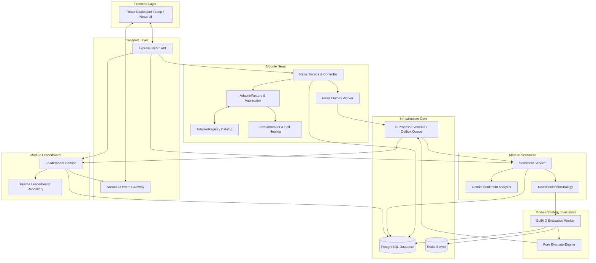
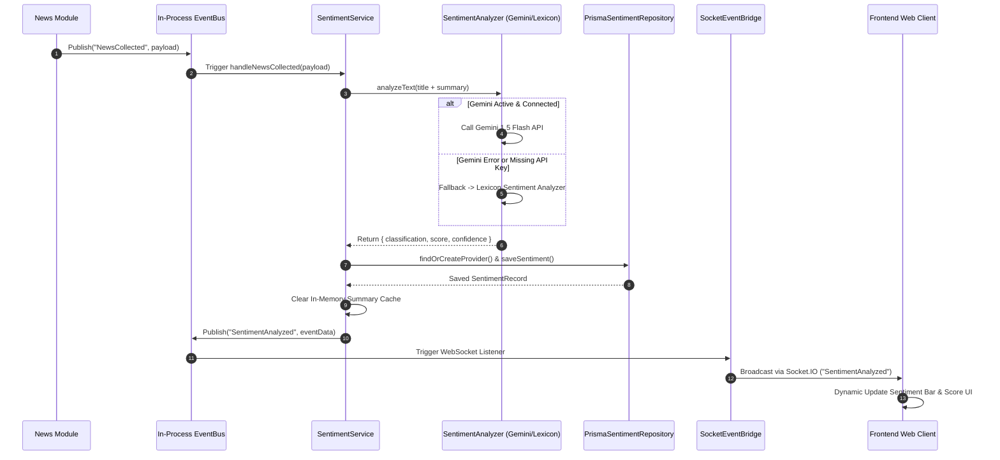
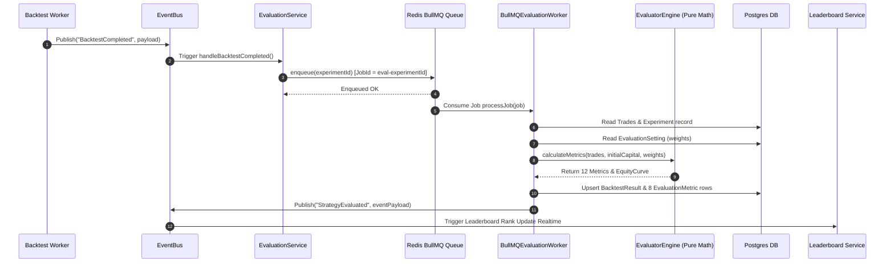

# Đặc tả Kiến trúc Chi tiết 4 Module Core
## News Crawler, Sentiment Analysis, Strategy Evaluation, & Leaderboard Realtime

> **Hệ thống Crypto Strategy Lab – Đồ án Software Architecture**

---

## 📋 Mục lục

1. [Tổng quan Kiến trúc Tổng thể](#1-tổng-quan-kiến-trúc-tổng-thể)
   - [1.1 Sơ đồ Tổng quan Hệ thống](#11-sơ-đồ-tổng-quan-hệ-thống)
   - [1.2 Cơ chế Truyền thông Realtime (Event, EventBus & Socket.IO Bridge)](#12-cơ-chế-truyền-thông-realtime-event-eventbus--socketio-bridge)
2. [Module 1 – News Crawler & Extraction Engine](#2-module-1--news-crawler--extraction-engine)
   - [2.1 Các Design Patterns Cốt lõi (6 Architectural Patterns)](#21-các-design-patterns-cốt-lõi-6-architectural-patterns)
   - [2.2 Phân tích Phối hợp giữa AdapterRegistry và AdapterFactory](#22-phân-tích-phối-hợp-giữa-adapterregistry-và-adapterfactory)
   - [2.3 Các Loại News Provider (NewsAPI, RSS, HTML Scraper)](#23-các-loại-news-provider-newsapi-rss-html-scraper)
   - [2.4 Đáp ứng Functional & Non-Functional Requirements](#24-đáp-ứng-functional--non-functional-requirements)
   - [2.5 Phân tích Trade-offs (Đánh đổi & Giải pháp)](#25-phân-tích-trade-offs-đánh-đổi--giải-pháp)
   - [2.6 Chi tiết Cấu trúc File & Trách nhiệm (Tất cả 15 File Hạ tầng)](#26-chi-tiết-cấu-trúc-file--trách-nhiệm-tất-cả-15-file-hạ-tầng)
   - [2.7 Hướng dẫn 4 Bước Thêm một Nguồn Crawl News Mới](#27-hướng-dẫn-4-bước-thêm-một-nguồn-crawl-news-mới)
3. [Module 2 – Sentiment Analysis & Strategy Integration](#3-module-2--sentiment-analysis--strategy-integration)
   - [3.1 Các Architectural Patterns Cốt lõi (6 Patterns)](#31-các-architectural-patterns-cốt-lõi-6-patterns)
   - [3.2 Luồng Nhận & Xử lý Event Chi tiết (NewsCollected → SentimentAnalyzed)](#32-luồng-nhận--xử-lý-event-chi-tiết-newscollected--sentimentanalyzed)
   - [3.3 Tích hợp Sentiment vào Chiến thuật Giao dịch (NewsSentimentStrategy & SentimentDataFeed)](#33-tích-hợp-sentiment-vào-chiến-thuật-giao-dịch-newssentimentstrategy--sentimentdatafeed)
   - [3.4 Đáp ứng Functional & Non-Functional Requirements](#34-đáp-ứng-functional--non-functional-requirements)
   - [3.5 Phân tích Trade-offs (Đánh đổi & Giải pháp)](#35-phân-tích-trade-offs-đánh-đổi--giải-pháp)
   - [3.6 Chi tiết Cấu trúc File & Trách nhiệm (Tất cả 10 File của Module)](#36-chi-tiết-cấu-trúc-file--trách-nhiệm-tất-cả-10-file-của-module)
4. [Module 3 – Strategy Evaluation Engine](#4-module-3--strategy-evaluation-engine)
   - [4.1 Các Architectural Patterns Cốt lõi (4 Patterns)](#41-các-architectural-patterns-cốt-lõi-4-patterns)
   - [4.2 Chi tiết 12 Chỉ số Tài chính Định lượng & Công thức Toán học](#42-chi-tiết-12-chỉ-số-tài-chính-định-lượng--công-thức-toán-học)
   - [4.3 Luồng Vận hành Kiến trúc (Producer - Worker Queue)](#43-luồng-vận-hành-kiến-trúc-producer---worker-queue)
   - [4.4 Đáp ứng Functional & Non-Functional Requirements](#44-đáp-ứng-functional--non-functional-requirements)
   - [4.5 Phân tích Trade-offs (Đánh đổi & Giải pháp)](#45-phân-tích-trade-offs-đánh-đổi--giải-pháp)
   - [4.6 Chi tiết Cấu trúc File & Trách nhiệm (Tất cả 6 File của Module)](#46-chi-tiết-cấu-trúc-file--trách-nhiệm-tất-cả-6-file-của-module)
5. [Module 4 – Leaderboard & Realtime Stream](#5-module-4--leaderboard--realtime-stream)
   - [5.1 Các Architectural Patterns Cốt lõi (4 Patterns)](#51-các-architectural-patterns-cốt-lõi-4-patterns)
   - [5.2 Luồng Vận hành Chi tiết (Event-Driven Ranking & Realtime Broadcast)](#52-luồng-vận-hành-chi-tiết-event-driven-ranking--realtime-broadcast)
   - [5.3 Cơ chế Lấy dữ liệu qua REST API & Realtime Socket.IO](#53-cơ-chế-lấy-dữ-liệu-qua-rest-api--realtime-socketio)
   - [5.4 Đáp ứng Functional & Non-Functional Requirements](#54-đáp-ứng-functional--non-functional-requirements)
   - [5.5 Phân tích Trade-offs (Đánh đổi & Giải pháp)](#55-phân-tích-trade-offs-đánh-đổi--giải-pháp)
   - [5.6 Chi tiết Cấu trúc File & Trách nhiệm (Tất cả 8 File của Module)](#56-chi-tiết-cấu-trúc-file--trách-nhiệm-tất-cả-8-file-của-module)
6. [Luồng Vận hành Thực tế (End-to-End Practical Example)](#6-luồng-vận-hành-thực-tế-end-to-end-practical-example)

---

## 1. Tổng quan Kiến trúc Tổng thể

Hệ thống **Crypto Strategy Lab** được thiết kế theo nguyên lý **Clean Architecture** và **Domain-Driven Design (DDD)** nhằm đáp ứng các thuộc tính chất lượng phần mềm quan trọng: **Khả năng Mở rộng (Scalability), Khả năng Thay đổi (Modifiability), Độ chịu lỗi (Fault Tolerance) và Tính Bảo trì (Maintainability)**.

### 1.1 Sơ đồ Tổng quan Hệ thống



---

### 1.2 Cơ chế Truyền thông Realtime (Event, EventBus & Socket.IO Bridge)

#### 💡 A. Khái niệm & Sự khác biệt cốt lõi
1. **Event (Sự kiện)**: Là một gói tin dữ liệu (Notification Payload) thông báo về một sự việc vừa xảy ra trong quá khứ của hệ thống. Tên event được đặt ở thì quá khứ: `NewsCollected`, `SentimentAnalyzed`, `CandleClosed`, `BacktestCompleted`.
2. **EventBus (Bộ Trung Chuyển Nội Bộ - In-Process Pub/Sub)**:
   - *Bản chất*: Là bộ định tuyến tin nhắn chạy hoàn toàn trong bộ nhớ RAM của Node.js Backend Server ([`EventBus.ts`](file:///e:/Documents/HCMUS/Semester3_Year3/Kiến%20trúc%20phần%mềm/crypto-strategy-lab/backend/src/shared/event-bus/EventBus.ts), dựa trên `EventEmitter`).
   - *Mục đích*: Giúp các Module Backend (`News`, `Sentiment`, `Evaluator`) nói chuyện với nhau mà **không cần phụ thuộc trực tiếp vào nhau (Loose Coupling)**.
   - *Cơ chế*: Service A gọi `bus.publish(eventName, payload)` $\rightarrow$ Service B gọi `bus.subscribe(eventName, handler)` để tiếp nhận.
3. **Socket.IO (Cầu Nối Mạng Trực Tuyến - Cross-Network Transport)**:
   - *Bản chất*: Là giao thức truyền thông mạng chạy trên nền WebSocket kết nối giữa **Backend Server** và **Trình duyệt Frontend (React)**.
   - *Mục đích*: Cho phép Server tự động đẩy (Push) dữ liệu xuống Browser theo thời gian thực mà người dùng **KHÔNG CẦN F5 hay gửi request hỏi liên tục (Polling)**.

#### 🌉 B. Cầu nối `SocketEventBridge` - Tại sao lại cần cả EventBus và Socket.IO?
- Các Service (như `NewsService`, `SentimentService`) chỉ giao tiếp qua `EventBus` để đảm bảo không bị dính chặt vào WebSocket (nếu sau này thay WebSocket bằng Webhook hay Kafka thì code Service giữ nguyên không đổi).
- Lớp Cầu nối [`SocketEventBridge`](file:///e:/Documents/HCMUS/Semester3_Year3/Kiến%20trúc%20phần%mềm/crypto-strategy-lab/backend/src/infrastructure/event-bridge/socket-bridge.ts) đóng vai trò là "Trạm trung chuyển": Nó đăng ký lắng nghe các sự kiện nội bộ từ `EventBus`, và mỗi khi có tin tức mới, nó dùng lệnh `io.emit()` để **bắn sự kiện đó xuyên qua mạng Internet** đến tất cả trình duyệt Frontend đang kết nối.

#### 🔄 C. Sơ đồ Luồng đi Code-level (Code Walkthrough Example: `NewsCollected` & `SentimentAnalyzed`)

```
[BƯỚC 1: CÀO TIN & PHÁT EVENT `NewsCollected`]
  │
  ├──► 📌 Hàm PHÁT (Publisher): NewsService.fetchAndStoreLatestNews()
  │    File: backend/src/modules/news/application/news.service.ts
  │    Code: this.eventBus.publish("NewsCollected", { newsId, title, summary, source, coinSymbols });
  │
  ├─────────────────────────────────────────────────────────────────────────┐
  │                                                                         │
  ▼                                                                         ▼
[BƯỚC 2A: SENTIMENT MODULE (NỘI BỘ BACKEND)]                      [BƯỚC 2B: SOCKET BRIDGE (ĐẨY RA NET)]
  │                                                                 │
  ├──► 📌 Hàm NHẬN (Subscriber): SentimentService.constructor()     ├──► 📌 Hàm NHẬN (Bridge Subscriber):
  │    File: backend/src/modules/sentiment/application/           │    File: backend/src/infrastructure/
  │          sentiment.service.ts                                   │          event-bridge/socket-bridge.ts
  │    Code: this.eventBus.subscribe("NewsCollected",               │    Code: bus.subscribe("NewsCollected", newsHandler);
  │          (payload) => this.handleNewsCollected(payload));       │
  │                                                                 ├──► 📌 Hàm BẮN MẠNG (Socket.IO Emitter):
  ├──► 🛠️ Thực thi: SentimentService.handleNewsCollected()          │    Code: io.emit("NewsCollected", payload);
  │    - Phân tích Gemini/Lexicon -> Upsert DB                      │
  │                                                                 ▼
  ├──► 📌 Hàm PHÁT KẾT QUẢ:                                       [BƯỚC 3: FRONTEND REACT CLIENT]
  │    File: backend/src/modules/sentiment/application/           │
  │          sentiment.service.ts                                   ├──► 📌 Hàm NHẬN WS (Browser Listener):
  │    Code: this.eventBus.publish("SentimentAnalyzed", {           │    File: frontend/src/lib/socket.ts
  │            newsId, sentimentId, classification, score           │    Code: socket.on("NewsCollected", (data) => ...);
  │          });                                                    │
  │                                                                 └──► 📌 Hàm RENDER GIAO DIỆN (React State):
  │                                                                      File: frontend/src/pages/NewsCrawler.tsx
  │                                                                      Code: onNewsCollected((item) => setNews(prev => [item, ...prev]));
  │                                                                      (UI cập nhật tin mới ngay lập tức 0ms!)
```

---

## 2. Module 1 – News Crawler & Extraction Engine

Module News chịu trách nhiệm tự động cào tin tức từ đa nguồn, chuẩn hóa dữ liệu về định dạng thống nhất `NewsItem`, lưu cơ sở dữ liệu và phát sự kiện sang hệ thống phân tích Sentiment.

### 2.1 Các Design Patterns Cốt lõi (6 Architectural Patterns)

1. **Adapter Pattern** ([`NewsProviderAdapter`](file:///e:/Documents/HCMUS/Semester3_Year3/Kiến%20trúc%20phần%20mềm/crypto-strategy-lab/backend/src/modules/news/domain/news.entity.ts)):
   - Chuẩn hóa giao diện thu thập dữ liệu tin tức. Mọi nguồn tin (từ REST API JSON, XML RSS Feed đến HTML Scraper) đều phải triển khai chung giao diện:
     ```typescript
     export interface NewsProviderAdapter {
       providerCode: string;
       fetchLatestNews(symbol?: string): Promise<Omit<NewsItem, "providerId">[]>;
     }
     ```
2. **Registry Pattern** ([`AdapterRegistry`](file:///e:/Documents/HCMUS/Semester3_Year3/Kiến%20trúc%20phần%20mềm/crypto-strategy-lab/backend/src/modules/news/infrastructure/adapter-registry.ts)):
   - Kho đăng ký dạng **Singleton Catalog** lưu vết tất cả các Adapter hiện có kèm metadata (code, priority, required API key, status enabled/disabled). Giúp hệ thống bật/tắt động bất kỳ nguồn tin nào tại runtime thông qua API Admin mà không cần restart server.
3. **Factory Method Pattern** ([`adapter-factory.ts`](file:///e:/Documents/HCMUS/Semester3_Year3/Kiến%20trúc%20phần%20mềm/crypto-strategy-lab/backend/src/modules/news/infrastructure/adapter-factory.ts)):
   - Trừu tượng hóa quá trình tạo đối tượng tin tức (`buildNewsAdapter()`). Đọc cấu hình biến môi trường (`NEWS_PROVIDERS`, `NEWSDATA_API_KEY`,...) để quyết định Adapter nào được kích hoạt.
4. **Composite Pattern** ([`AggregatingNewsAdapter`](file:///e:/Documents/HCMUS/Semester3_Year3/Kiến%20trúc%20phần%20mềm/crypto-strategy-lab/backend/src/modules/news/infrastructure/aggregating-news.adapter.ts)):
   - Gom nhiều Adapter độc lập thành **một Adapter tổng duy nhất**. Khi gọi `fetchLatestNews()`, nó phân tán yêu cầu cào tin song song tới tất cả nguồn qua `Promise.allSettled()`, khử trùng lặp (Deduplication) theo URL & Title Hash, và sắp xếp tin mới nhất lên đầu.
5. **Circuit Breaker Pattern** ([`circuit-breaker.ts`](file:///e:/Documents/HCMUS/Semester3_Year3/Kiến%20trúc%20phần%20mềm/crypto-strategy-lab/backend/src/modules/news/infrastructure/circuit-breaker.ts)):
   - Máy trạng thái ngắt mạch (`CLOSED` $\rightarrow$ `OPEN` $\rightarrow$ `HALF_OPEN`). Nếu một nguồn tin bị sập hoặc dính Rate Limit (3 lần thất bại liên tiếp), Circuit Breaker ngắt kết nối nguồn đó trong 60 giây (Fast-fail) để bảo vệ toàn hệ thống không bị ngơ.
6. **Transactional Outbox Pattern** ([`news-outbox.worker.ts`](file:///e:/Documents/HCMUS/Semester3_Year3/Kiến%20trúc%20phần%20mềm/crypto-strategy-lab/backend/src/modules/news/infrastructure/news-outbox.worker.ts)):
   - Đảm bảo tính toàn vẹn sự kiện: Tin tức lưu DB và sự kiện Outbox (`QueueJob`) được ghi trong cùng **1 Prisma Transaction**. Worker chạy ngầm sẽ đọc các job `PENDING` để phát sang EventBus và Socket.IO.

---

### 2.2 Phân tích Phối hợp giữa AdapterRegistry và AdapterFactory

| Tiêu chí | `AdapterRegistry` (Catalog) | `adapter-factory.ts` (Bootstrapper & Factory) |
| :--- | :--- | :--- |
| **Bản chất** | In-Process Singleton State Registry. | Creational Function & Entry point khởi tạo. |
| **Trách nhiệm** | Lưu danh sách đăng ký, kiểm tra API key, quản lý bật/tắt (enabled/disabled) và thứ tự ưu tiên (priority). | Đọc `.env`, gọi `bootstrapRegistry()`, lọc nguồn active và đóng gói thành `AggregatingNewsAdapter`. |
| **Thời điểm chạy** | Duy trì suốt vòng đời ứng dụng (In-Memory). | Chạy lúc Boot Server (gọi từ `news.container.ts`). |
| **Lợi ích Clean Architecture** | Tách biệt hoàn toàn việc lưu giữ trạng thái Adapter với logic tạo đối tượng. | Tầng Application (`NewsService`) chỉ nhận 1 adapter duy nhất qua DI. |

---

### 2.3 Các Loại News Provider (NewsAPI, RSS, HTML Scraper)

Module News hỗ trợ 3 nhóm nguồn tin tức chính:

```
                          ┌───────────────────────────┐
                          │   NewsProviderAdapter     │
                          └─────────────┬─────────────┘
                                        │
        ┌───────────────────────────────┼───────────────────────────────┐
        ▼                               ▼                               ▼
┌───────────────┐               ┌───────────────┐               ┌───────────────┐
│   NewsAPI     │               │   RSS Feed    │               │  HTML Scraper │
│ (Structured)  │               │ (XML Syndic)  │               │(Web Scraping) │
└───────┬───────┘               └───────┬───────┘               └───────┬───────┘
        │                               │                               │
  • NewsData.io                   • CoinDesk RSS                  • HtmlNewsAdapter
  • CryptoCompare                 • Cointelegraph RSS             • LLM Template
  • CryptoPanic                   • Bitcoin Magazine              • Self-Healing
```

1. **NewsAPI (Structured REST APIs)**:
   - *Ví dụ*: `NewsDataNewsAdapter`, `CryptoCompareNewsAdapter`, `CryptopanicNewsAdapter`.
   - *Đặc điểm*: Dữ liệu JSON có cấu trúc chuẩn, độ tin cậy cao, kèm mã coin symbols sẵn. Yêu cầu có **API Key cá nhân** cấu hình trong `.env`.
2. **RSS Feeds (XML Syndication Feeds)**:
   - *Ví dụ*: `CoinDeskRssAdapter`, `CointelegraphRssAdapter`, `BitcoinMagazineRssAdapter`.
   - *Đặc điểm*: Dữ liệu phát hành XML công khai từ các tòa soạn báo. **Miễn phí 100%**, **không cần API Key**, cào tin cực nhanh. Tự động bật mặc định nếu không cấu hình `NEWS_PROVIDERS`.
3. **HTML Scraper (Web Scraping)**:
   - *Ví dụ*: `HtmlNewsAdapter` (kết hợp Cheerio + DOM Selector).
   - *Đặc điểm*: Dùng cào tin từ các website báo không có API hay RSS. Tự động dùng Gemini AI để tự sinh CSS Selector (`llm-extraction.template-manager.ts`) và tự phục hồi (`self-healing.orchestrator.ts`) khi DOM báo thay đổi.

---

### 2.4 Đáp ứng Functional & Non-Functional Requirements

- **FR-050 $\rightarrow$ FR-055**: Thu thập, chuẩn hóa `NewsItem`, lưu PostgreSQL, hiển thị tin tức trực quan trên UI.
- **NFR-004 (News Provider Extensibility)**: Thêm bất kỳ nguồn tin mới nào (API/RSS/Scraper) chỉ cần viết thêm 1 class triển khai `NewsProviderAdapter` và đăng ký trong Registry.
- **NFR-019 (News Failure Isolation)**: Lỗi cào tin từ một báo hoặc mất kết nối mạng được cách ly bởi Circuit Breaker và `Promise.allSettled()`; không làm gián đoạn hệ thống.

---

### 2.5 Phân tích Trade-offs (Đánh đổi & Giải pháp)

| Ưu điểm Kiến trúc | Trade-off (Sự Đánh đổi) | Giải pháp Khắc phục |
| :--- | :--- | :--- |
| **Composite Aggregator** giúp cào song song từ hàng chục nguồn cùng lúc. | Có nguy cơ bị trùng lặp bài báo xuất bản trên nhiều trang khác nhau. | Thuật toán `dedupeNews()` khử trùng 2 lớp: theo `UrlHost+Path` và theo `Normalized Title Hash`. |
| **Outbox Pattern** đảm bảo không bao giờ mất sự kiện tin tức. | Tăng nhẹ lượng ghi I/O vào bảng `QueueJob` của PostgreSQL. | Worker tự động xoá hoặc đánh dấu `PUBLISHED` cho các job cũ định kỳ. |
| **LLM Self-Healing** tự sửa CSS Selector khi báo đổi giao diện. | Chi phí Token API và Latency khi gọi Gemini API. | Cache Selector Template theo version (`v1.4.2`). Chỉ kích hoạt Gemini khi tỷ lệ trích xuất lỗi $> 10\%$. |

---

### 2.6 Chi tiết Cấu trúc File & Trách nhiệm (Tất cả 15 File Hạ tầng)

#### 🏢 Domain Layer (`backend/src/modules/news/domain/`)
- [`news.entity.ts`](file:///e:/Documents/HCMUS/Semester3_Year3/Kiến%20trúc%20phần%20mềm/crypto-strategy-lab/backend/src/modules/news/domain/news.entity.ts): Định nghĩa `NewsItem`, `NewsProviderEntity`, interface `NewsProviderAdapter` và `NewsRepository`.
- [`extraction.entity.ts`](file:///e:/Documents/HCMUS/Semester3_Year3/Kiến%20trúc%20phần%20mềm/crypto-strategy-lab/backend/src/modules/news/domain/extraction.entity.ts): Định nghĩa entity template trích xuất DOM, kết quả kiểm định chất lượng (`QualityValidationResult`).

#### 🛠️ Infrastructure Layer (`backend/src/modules/news/infrastructure/`)
1. [`adapter-registry.ts`](file:///e:/Documents/HCMUS/Semester3_Year3/Kiến%20trúc%20phần%20mềm/crypto-strategy-lab/backend/src/modules/news/infrastructure/adapter-registry.ts): Singleton kho lưu trữ danh sách các Adapter, quản lý ưu tiên (priority) và runtime enable/disable.
2. [`adapter-factory.ts`](file:///e:/Documents/HCMUS/Semester3_Year3/Kiến%20trúc%20phần%20mềm/crypto-strategy-lab/backend/src/modules/news/infrastructure/adapter-factory.ts): Đọc biến môi trường `.env`, kích hoạt registry và tạo ra `AggregatingNewsAdapter`.
3. [`aggregating-news.adapter.ts`](file:///e:/Documents/HCMUS/Semester3_Year3/Kiến%20trúc%20phần%20mềm/crypto-strategy-lab/backend/src/modules/news/infrastructure/aggregating-news.adapter.ts): Composite Adapter thực thi cào song song, merge và dedupe tin tức.
4. [`newsdata-news.adapter.ts`](file:///e:/Documents/HCMUS/Semester3_Year3/Kiến%20trúc%20phần%20mềm/crypto-strategy-lab/backend/src/modules/news/infrastructure/newsdata-news.adapter.ts): Adapter kết nối API của NewsData.io.
5. [`cryptocompare-news.adapter.ts`](file:///e:/Documents/HCMUS/Semester3_Year3/Kiến%20trúc%20phần%mềm/crypto-strategy-lab/backend/src/modules/news/infrastructure/cryptocompare-news.adapter.ts): Adapter kết nối API của CryptoCompare.
6. [`cryptopanic-news.adapter.ts`](file:///e:/Documents/HCMUS/Semester3_Year3/Kiến%20trúc%20phần%mềm/crypto-strategy-lab/backend/src/modules/news/infrastructure/cryptopanic-news.adapter.ts): Adapter kết nối API của CryptoPanic.
7. [`rss-feed.adapters.ts`](file:///e:/Documents/HCMUS/Semester3_Year3/Kiến%20trúc%20phần%mềm/crypto-strategy-lab/backend/src/modules/news/infrastructure/rss-feed.adapters.ts): Tập hợp các Adapter cào RSS Feeds (CoinDesk, Cointelegraph, Bitcoin Magazine).
8. [`rss-news.adapter.ts`](file:///e:/Documents/HCMUS/Semester3_Year3/Kiến%20trúc%20phần%mềm/crypto-strategy-lab/backend/src/modules/news/infrastructure/rss-news.adapter.ts): Adapter mock tin tức giả phục vụ dev/testing offline.
9. [`html-news.adapter.ts`](file:///e:/Documents/HCMUS/Semester3_Year3/Kiến%20trúc%20phần%mềm/crypto-strategy-lab/backend/src/modules/news/infrastructure/html-news.adapter.ts): Adapter cào tin web HTML bằng Cheerio.
10. [`circuit-breaker.ts`](file:///e:/Documents/HCMUS/Semester3_Year3/Kiến%20trúc%20phần%mềm/crypto-strategy-lab/backend/src/modules/news/infrastructure/circuit-breaker.ts): Lớp ngắt mạch bảo vệ chống quá tải / sập mạng từ nguồn tin bên ngoài.
11. [`self-healing.orchestrator.ts`](file:///e:/Documents/HCMUS/Semester3_Year3/Kiến%20trúc%20phần%mềm/crypto-strategy-lab/backend/src/modules/news/infrastructure/self-healing.orchestrator.ts): Tự động phát hiện DOM lỗi và trigger Gemini sửa selector.
12. [`llm-extraction.template-manager.ts`](file:///e:/Documents/HCMUS/Semester3_Year3/Kiến%20trúc%20phần%mềm/crypto-strategy-lab/backend/src/modules/news/infrastructure/llm-extraction.template-manager.ts): Quản lý Prompt templates và giao tiếp với Gemini API.
13. [`news-crawler.queue.ts`](file:///e:/Documents/HCMUS/Semester3_Year3/Kiến%20trúc%20phần%mềm/crypto-strategy-lab/backend/src/modules/news/infrastructure/news-crawler.queue.ts): Hàng chờ CronJob định kỳ trigger cào tin.
14. [`news-outbox.worker.ts`](file:///e:/Documents/HCMUS/Semester3_Year3/Kiến%20trúc%20phần%mềm/crypto-strategy-lab/backend/src/modules/news/infrastructure/news-outbox.worker.ts): Polling worker đọc Outbox event từ DB và phát sang Socket/EventBus.
15. [`prisma-news.repository.ts`](file:///e:/Documents/HCMUS/Semester3_Year3/Kiến%20trúc%20phần%mềm/crypto-strategy-lab/backend/src/modules/news/infrastructure/prisma-news.repository.ts): Thực thi truy vấn PostgreSQL qua Prisma ORM.

---

### 2.7 Hướng dẫn 4 Bước Thêm một Nguồn Crawl News Mới

1. **Bước 1**: Tạo file Adapter mới triển khai `NewsProviderAdapter` (ví dụ `decrypt-news.adapter.ts`).
2. **Bước 2**: Đăng ký trong `bootstrapRegistry()` tại [`adapter-factory.ts`](file:///e:/Documents/HCMUS/Semester3_Year3/Kiến%20trúc%20phần%mềm/crypto-strategy-lab/backend/src/modules/news/infrastructure/adapter-factory.ts) với `code: "decrypt"`.
3. **Bước 3**: Thêm code `"decrypt"` vào biến môi trường `NEWS_PROVIDERS` trong `.env`.
4. **Bước 4**: Viết unit test cho adapter mới. `AggregatingNewsAdapter` sẽ tự động phát hiện và cào song song nguồn mới này mà **không cần sửa 1 dòng code nào ở tầng Application hay Controller**!

---

## 3. Module 2 – Sentiment Analysis & Strategy Integration

Module Sentiment chịu trách nhiệm tiếp nhận tin tức vừa được cào, tự động phân tích chỉ số cảm xúc thị trường (Sentiment Score & Classification), lưu trữ lịch sử phân tích và cung cấp tín hiệu giao dịch cho bộ công cụ chiến thuật (Strategy Engine & Backtester).

### 3.1 Các Architectural Patterns Cốt lõi (6 Patterns)

1. **Clean Architecture (Layered Architecture)**:
   - Phân chia module thành 4 lớp rõ ràng: Domain (Entity/Interface) $\leftarrow$ Application (Use-case/Cache) $\leftarrow$ Infrastructure (Prisma DB, Gemini LLM, Lexicon) $\leftarrow$ Presentation (Controller/Router). Giúp logic phân tích cảm xúc hoàn toàn không phụ thuộc vào framework web hay ORM.

2. **Strategy Pattern / Plugin Architecture** ([`SentimentAnalyzer`](file:///e:/Documents/HCMUS/Semester3_Year3/Kiến%20trúc%20phần%mềm/crypto-strategy-lab/backend/src/modules/sentiment/domain/sentiment.entity.ts)):
   - Trừu tượng hóa bộ phân tích sentiment thành interface `SentimentAnalyzer`. Cho phép thay đổi thuật toán phân tích giữa **Gemini 1.5 Flash LLM** ([`GeminiSentimentAnalyzer`](file:///e:/Documents/HCMUS/Semester3_Year3/Kiến%20trúc%20phần%mềm/crypto-strategy-lab/backend/src/modules/sentiment/infrastructure/gemini-sentiment.analyzer.ts)) và **Lexicon Rule-based** ([`LexiconSentimentAnalyzer`](file:///e:/Documents/HCMUS/Semester3_Year3/Kiến%20trúc%20phần%mềm/crypto-strategy-lab/backend/src/modules/sentiment/infrastructure/lexicon-sentiment.analyzer.ts)) chỉ bằng việc cấu hình lại biến môi trường `.env` (`SENTIMENT_ANALYZER=gemini` hoặc `lexicon`).

3. **Event-Driven Architecture (EDA) & Observer Pattern**:
   - `SentimentService` đăng ký lắng nghe sự kiện `NewsCollected` phát ra từ `EventBus` nội bộ. Module tin tức không gọi trực tiếp Sentiment Service, giúp giảm tối đa độ phụ thuộc trực tiếp (Loose Coupling).

4. **Fallback Pattern / Graceful Degradation (Mẫu Dự Phòng)**:
   - Trong `GeminiSentimentAnalyzer`, nếu không có Gemini API Key hoặc kết nối mạng bị gián đoạn, hệ thống tự động bẫy lỗi và chuyển sang gọi `LexiconSentimentAnalyzer` ngầm để phân tích điểm mà không làm dừng luồng xử lý của ứng dụng.

5. **Repository Pattern** ([`SentimentRepository`](file:///e:/Documents/HCMUS/Semester3_Year3/Kiến%20trúc%20phần%mềm/crypto-strategy-lab/backend/src/modules/sentiment/domain/sentiment.entity.ts)):
   - Che giấu chi tiết truy vấn database. Mọi thao tác tìm provider, upsert kết quả sentiment và tính toán điểm trung bình tổng hợp theo từng Coin `baseAsset` đều thông qua interface kho chứa [`PrismaSentimentRepository`](file:///e:/Documents/HCMUS/Semester3_Year3/Kiến%20trúc%20phần%mềm/crypto-strategy-lab/backend/src/modules/sentiment/infrastructure/prisma-sentiment.repository.ts).

6. **In-Memory Cache với TTL (Bộ Nhớ Đệm Tạm)**:
   - `SentimentService` quản lý một bộ nhớ đệm `summaryCache` (LRU Map) với thời gian hết hạn (TTL) 30 giây cho điểm tổng hợp `getSentimentSummary(symbol)`. Giảm thiểu số lần truy vấn Aggregate trên PostgreSQL khi Frontend liên tục polling dữ liệu.

---

### 3.2 Luồng Nhận & Xử lý Event Chi tiết (`NewsCollected` $\rightarrow$ `SentimentAnalyzed`)



#### Quy trình 5 bước thực thi trong Code (`handleNewsCollected`):
1. **Trích xuất văn bản**: Ghép tiêu đề (`title`) và tóm tắt (`summary`) của bài báo thành chuỗi văn bản phân tích.
2. **Thực thi phân tích**: Gọi `this.analyzer.analyzeText(text)`. Nếu dùng Gemini API và gặp lỗi mạng $\rightarrow$ tự hạ cấp xuống bộ từ điển Lexicon (gồm 110+ từ Tiếng Anh & 60+ từ Tiếng Việt chuyên ngành crypto). Trả về điểm `score` $[-1.0, 1.0]$ và gán nhãn `POSITIVE`, `NEUTRAL`, hoặc `NEGATIVE`.
3. **Lưu Cơ sở dữ liệu (Upsert)**: Đăng ký/lấy ID của `SentimentProvider`, gọi `repository.saveSentiment()` ghi kết quả phân tích vào bảng `Sentiment` trong Postgres.
4. **Invalidate Cache**: Gọi `this.summaryCache.clear()` để làm mới điểm Sentiment trung bình của hệ thống.
5. **Phát Event đầu ra (`SentimentAnalyzed`)**: Bắn event `SentimentAnalyzed` vào `EventBus`. Lớp [`SocketEventBridge`](file:///e:/Documents/HCMUS/Semester3_Year3/Kiến%20trúc%20phần%mềm/crypto-strategy-lab/backend/src/infrastructure/event-bridge/socket-bridge.ts) chuyển tiếp event này đến Client qua Socket.IO để UI tự động cập nhật điểm số mà không cần F5.

---

### 3.3 Tích hợp Sentiment vào Chiến thuật Giao dịch (`NewsSentimentStrategy` & `SentimentDataFeed`)

Module Sentiment cung cấp 2 cơ chế tích hợp trực tiếp vào bộ máy giao dịch (Strategy Engine):

1. **`SentimentDataFeed`** ([`sentiment-data-feed.ts`](file:///e:/Documents/HCMUS/Semester3_Year3/Kiến%20trúc%20phần%mềm/crypto-strategy-lab/backend/src/modules/sentiment/application/sentiment-data-feed.ts)):
   - Chuẩn hóa cặp tiền (ví dụ `BTCUSDT` $\rightarrow$ `BTC`).
   - Cung cấp hàm `getAverageSentimentScore(symbol, lookbackWindowMs, untilTime)` cho phép tính toán điểm tâm lý thị trường trung bình của một đồng coin trong cửa sổ thời gian quá khứ bất kỳ (Lookback Window).

2. **`NewsSentimentStrategy`** ([`NewsSentimentStrategy.ts`](file:///e:/Documents/HCMUS/Semester3_Year3/Kiến%20trúc%20phần%mềm/crypto-strategy-lab/backend/src/modules/strategy/strategies/NewsSentimentStrategy.ts)):
   - Triển khai chuẩn giao diện `Strategy`.
   - Đóng vai trò là một chiến thuật độc lập hoặc chỉ báo thành phần (Indicator Component).

#### 3.3.1 Cơ chế Đánh giá & Phát Tín hiệu Mua/Bán (`BUY` / `SELL` / `HOLD`)
* **Đánh giá tin tức đơn lẻ**: Các bài báo khi cào về được `SentimentAnalyzer` (Gemini hoặc Lexicon) đánh giá và gán điểm $S_i \in [-1.0, 1.0]$ kèm nhãn:
  - **`POSITIVE` (Tích cực)**: $S_i > +0.15$ (Tin tăng trưởng, phê duyệt ETF, đối tác lớn, tích lũy).
  - **`NEGATIVE` (Tiêu cực)**: $S_i < -0.15$ (Tin hack, bị cấm, kiện tụng, sập sàn, thanh lý).
  - **`NEUTRAL` (Trung tính)**: $-0.15 \le S_i \le +0.15$ (Tin phân tích kỹ thuật chung, thông tin lề).
* **Tính điểm Trung bình Cửa sổ Thời gian ($\bar{S}$)**: `SentimentDataFeed` truy vấn các bài báo của đồng Coin trong $H$ giờ quá khứ (`lookbackWindowHours`) và tính điểm trung bình:
  $$\bar{S} = \frac{\sum_{i=1}^{N} S_i}{N}$$
* **Quy tắc phát lệnh trong `analyze(ctx)`**:
  - **`BUY`**: Khi $\bar{S} \ge \text{buyThreshold}$ (Mặc định $+0.7$). Chỉ số tâm lý tin tức cực kỳ tích cực.
  - **`SELL`**: Khi $\bar{S} \le \text{sellThreshold}$ (Mặc định $-0.7$). Chỉ số tâm lý tin tức vô cùng tồi tệ.
  - **`HOLD`**: Khi $\text{sellThreshold} < \bar{S} < \text{buyThreshold}$. Tin tức ở mức bình thường/trung tính, giữ nguyên vị thế.

#### 3.3.2 Cấu hình Tham số khi chạy Continuous Loops Engine
Khi kích hoạt **Continuous Loop Engine** (Tự động tối ưu hóa tham số & sinh ứng viên chiến thuật):
* **Nếu chạy chiến thuật đơn `NewsSentimentStrategy`**: Bộ sinh tham số (Domain Guided Generator / Grid Search / Random Search) sẽ tự động duyệt/tối ưu các tham số trong miền giá trị `ParamSpec`:
  - `lookbackWindowHours`: Thuộc khoảng $[1, 24]$ giờ (Mặc định: 1h, 4h, 12h, 24h).
  - `buyThreshold`: Thuộc khoảng $[+0.1, +1.0]$ (Mặc định: +0.7).
  - `sellThreshold`: Thuộc khoảng $[-1.0, -0.1]$ (Mặc định: -0.7, ràng buộc $\text{sellThreshold} < \text{buyThreshold}$).
* **Nếu kết hợp trong Combination Strategy (Composite)**:
  - `weight`: Trọng số niềm tin của tin tức so với các chỉ báo kỹ thuật (ví dụ: News Sentiment 0.3 + MA Cross 0.4 + RSI 0.3).
  - `operator`: Toán tử kết hợp (`WEIGHTED` - tính tổng điểm trọng số, hoặc `AND` - bắt buộc cả Tin tức và Kỹ thuật cùng đồng thuận mới phát lệnh).

#### 3.3.3 Trường hợp KHÔNG tích hợp vs. BẬT tích hợp Sentiment vào Combination
* **Nếu KHÔNG tích hợp Sentiment vào Combination**: Chiến thuật chạy dựa trên các chỉ báo kỹ thuật thuần túy (Candlestick Data: MA, RSI, MACD,...). Điểm mua/bán chỉ dựa trên đường giá và khối lượng. Hệ thống hoạt động hoàn toàn bình thường.
* **Khi BẬT tích hợp Sentiment**: Sentiment đóng vai trò làm **Bộ lọc rủi ro (Confluence Filter)**. *Ví dụ:* RSI báo `BUY` (quá bán), nhưng Sentiment báo `SELL` (tin bão xấu ngập tràn) $\rightarrow$ Chiến thuật Combination với toán tử `WEIGHTED` hoặc `AND` sẽ **ngăn chặn lệnh BUY**, bảo vệ tài khoản khỏi cú xả (Dump).

#### 3.3.4 Thời điểm Tính toán Tín hiệu Mua/Bán
Tín hiệu Mua (`BUY`) và Bán (`SELL`) được tính toán tại **2 thời điểm chính**:
1. **Khi chạy Backtest / Evaluator**: `BacktestService` duyệt qua từng cây nến lịch sử $i$. Tại mỗi nến, nó gọi `SentimentDataFeed` lấy điểm sentiment $\bar{S}$ của khoảng thời gian đó, nạp vào `ctx.metadata.sentimentScore` và thực thi `strategy.analyze(ctx)`.
2. **Khi chạy Realtime Engine**: Mỗi khi có nến mới đóng (`CandleClosed`) hoặc có tin tức mới (`NewsCollected` $\rightarrow$ `SentimentAnalyzed`), engine gọi `analyze(ctx)` với giá và điểm sentiment mới nhất.

#### 3.3.5 Cơ chế Cập nhật Dữ liệu Realtime & Cập nhật khi chạy Loops
* **Khi Loop đang chạy (Execution of Iterations in Continuous Loop)**: **TỰ ĐỘNG CẬP NHẬT Ở MỖI ITERATION!** Mỗi khi Loop chuyển sang vòng lặp mới ($N+1$), `LoopOrchestratorRunner` gọi `BacktestService.executeBacktest()`. Hàm này tự động kéo toàn bộ dữ liệu Sentiment **mới nhất hiện có trong PostgreSQL Database** tại thời điểm đó. Do đó, nếu giữa chừng có 50 tin tức mới được cào và phân tích xong, vòng lặp Loop tiếp theo sẽ ngay lập tức sử dụng dữ liệu Sentiment mới này để đánh giá lại điểm số (`overallScore`, `winRate`, `totalReturn`) và điều chỉnh vị trí các Candidate trên Leaderboard.
* **Khi Candidate đang chạy Realtime**: Ngay khi tin mới được cào $\rightarrow$ `SentimentService` phân tích $\rightarrow$ phát event `SentimentAnalyzed` qua Socket.IO. Candidate đang chạy Realtime sẽ nhận được `sentimentScore` mới nhất và cập nhật ngay lập tức trạng thái tín hiệu Mua/Bán mà **không cần phải khởi động lại Loop**.

---

### 3.4 Đáp ứng Functional & Non-Functional Requirements

- **FR-056 $\rightarrow$ FR-060**: Phân tích Sentiment tin tức thành `POSITIVE`, `NEUTRAL`, `NEGATIVE` kèm điểm số (`score` từ -1.0 đến +1.0) và độ tin cậy (`confidence`).
- **NFR-005 & AC-08 (Sentiment Model Extensibility)**: Dễ dàng mở rộng hoặc thay thế mô hình phân tích (Gemini, Lexicon, OpenAI, RoBERTa) nhờ giao diện `SentimentAnalyzer`.
- **Section 30 Spec**: Cho phép biến Sentiment thành chỉ báo tham gia tạo tín hiệu giao dịch và backtest lịch sử.

---

### 3.5 Phân tích Trade-offs (Đánh đổi & Giải pháp)

| Ưu điểm Kiến trúc | Trade-off (Sự Đánh đổi) | Giải pháp Khắc phục |
| :--- | :--- | :--- |
| **Event-Driven Execution** giúp phân tích tin tức ngầm mà không làm chậm luồng crawl tin. | **Eventual Consistency**: Tin tức vừa cào sẽ có độ trễ nhỏ (vài giây) trước khi có điểm Sentiment trong DB. | Hệ thống chạy cơ chế **Backfill** tự động bổ sung điểm cho các tin tức chưa có sentiment khi user mở ứng dụng. |
| **Strategy Pattern** cho phép linh hoạt đổi giữa LLM AI và Rule-based. | Gemini LLM API phụ thuộc vào kết nối mạng bên ngoài và có hạn ngạch (Quota limit). | Tích hợp **Fallback Pattern** tự động hạ cấp xuống `LexiconSentimentAnalyzer` (chạy hoàn toàn local, 0ms latency). |
| **In-Memory TTL Cache (30s)** giúp lấy tổng hợp Sentiment cực nhanh. | Dữ liệu tổng hợp có thể bị chậm tối đa 30 giây so với DB khi gọi HTTP GET. | Tự động gọi `clearCache()` ngay khi có tin tức mới vừa được phân tích xong. |

---

### 3.6 Chi tiết Cấu trúc File & Trách nhiệm (Tất cả 10 File của Module)

#### 🏢 Domain Layer (`backend/src/modules/sentiment/domain/`)
- [`sentiment.entity.ts`](file:///e:/Documents/HCMUS/Semester3_Year3/Kiến%20trúc%20phần%mềm/crypto-strategy-lab/backend/src/modules/sentiment/domain/sentiment.entity.ts): Định nghĩa kiểu dữ liệu `SentimentClass`, `SentimentAnalysisResult`, `SentimentRecord`, `SentimentSummary` và các Interface `SentimentAnalyzer`, `SentimentRepository`.

#### 🛠️ Infrastructure Layer (`backend/src/modules/sentiment/infrastructure/`)
1. [`lexicon-sentiment.analyzer.ts`](file:///e:/Documents/HCMUS/Semester3_Year3/Kiến%20trúc%20phần%mềm/crypto-strategy-lab/backend/src/modules/sentiment/infrastructure/lexicon-sentiment.analyzer.ts): Bộ phân tích điểm sentiment theo quy tắc từ điển (110+ từ tiếng Anh, 60+ từ tiếng Việt crypto).
2. [`gemini-sentiment.analyzer.ts`](file:///e:/Documents/HCMUS/Semester3_Year3/Kiến%20trúc%20phần%mềm/crypto-strategy-lab/backend/src/modules/sentiment/infrastructure/gemini-sentiment.analyzer.ts): Bộ phân tích sử dụng Gemini 1.5 Flash LLM qua Google AI API, tích hợp cơ chế Fallback xuống Lexicon.
3. [`prisma-sentiment.repository.ts`](file:///e:/Documents/HCMUS/Semester3_Year3/Kiến%20trúc%20phần%mềm/crypto-strategy-lab/backend/src/modules/sentiment/infrastructure/prisma-sentiment.repository.ts): Thực thi truy vấn cơ sở dữ liệu PostgreSQL qua Prisma (Upsert điểm sentiment, tính trung bình theo Coin `baseAsset`, tìm tin chưa phân tích).

#### 💼 Application & Strategy Layer (`backend/src/modules/sentiment/application/`)
4. [`sentiment.service.ts`](file:///e:/Documents/HCMUS/Semester3_Year3/Kiến%20trúc%20phần%mềm/crypto-strategy-lab/backend/src/modules/sentiment/application/sentiment.service.ts): Trái tim ứng dụng: Đăng ký sự kiện `NewsCollected`, gọi Analyzer phân tích, quản lý In-Memory Cache (TTL 30s), kích hoạt Backfill và phát sự kiện `SentimentAnalyzed`.
5. [`sentiment-data-feed.ts`](file:///e:/Documents/HCMUS/Semester3_Year3/Kiến%20trúc%20phần%mềm/crypto-strategy-lab/backend/src/modules/sentiment/application/sentiment-data-feed.ts): Lấy điểm Sentiment trung bình theo khung thời gian (Lookback Window) phục vụ cho Strategy Engine.
6. [`NewsSentimentStrategy.ts`](file:///e:/Documents/HCMUS/Semester3_Year3/Kiến%20trúc%20phần%mềm/crypto-strategy-lab/backend/src/modules/strategy/strategies/NewsSentimentStrategy.ts): Triển khai giao diện `Strategy`, phát tín hiệu BUY ($\ge +0.7$) / SELL ($\le -0.7$) / HOLD.

#### 🌐 Presentation & Integration Layer (`backend/src/modules/sentiment/presentation/`)
7. [`sentiment.controller.ts`](file:///e:/Documents/HCMUS/Semester3_Year3/Kiến%20trúc%20phần%mềm/crypto-strategy-lab/backend/src/modules/sentiment/presentation/sentiment.controller.ts): Controller xử lý REST API request `GET /api/sentiment/summary`.
8. [`sentiment.routes.ts`](file:///e:/Documents/HCMUS/Semester3_Year3/Kiến%20trúc%20phần%mềm/crypto-strategy-lab/backend/src/modules/sentiment/presentation/sentiment.routes.ts): Khai báo Express Router, tự động inject `GeminiSentimentAnalyzer` hoặc `LexiconSentimentAnalyzer` dựa trên biến môi trường `.env`.
9. [`index.ts`](file:///e:/Documents/HCMUS/Semester3_Year3/Kiến%20trúc%20phần%mềm/crypto-strategy-lab/backend/src/modules/sentiment/index.ts): Export public API của module Sentiment.
10. [`socket-bridge.ts`](file:///e:/Documents/HCMUS/Semester3_Year3/Kiến%20trúc%20phần%mềm/crypto-strategy-lab/backend/src/infrastructure/event-bridge/socket-bridge.ts): Lắng nghe sự kiện `SentimentAnalyzed` từ EventBus và broadcast dữ liệu Realtime đến Frontend qua Socket.IO.

---

## 4. Module 3 – Strategy Evaluation Engine

Module Evaluation đóng vai trò là "bộ não đánh giá định lượng" của hệ thống, chịu trách nhiệm đo lường toàn diện hiệu quả giao dịch của chiến thuật thông qua 12 chỉ số tài chính, tính toán đường cong vốn (`equityCurve`), áp dụng công thức phạt quá khớp (`Trade-Count Penalty`) và xếp hạng chiến thuật trên Leaderboard.

### 4.1 Các Architectural Patterns Cốt lõi (4 Patterns)

1. **Pure Functional Domain Engine** ([`EvaluatorEngine.ts`](file:///e:/Documents/HCMUS/Semester3_Year3/Kiến%20trúc%20phần%mềm/crypto-strategy-lab/backend/src/modules/evaluation/domain/evaluator.engine.ts)):
   - `EvaluatorEngine` là một Pure Class hoàn toàn thuần túy, 0ms I/O (không phụ thuộc vào PostgreSQL Database, Express, hay Redis). Nhận vào mảng các giao dịch `TradeInput[]` và trả về kết quả tính toán ngay lập tức trong RAM. Điều này giúp Unit Test đạt độ chính xác 100% và tốc độ thực thi tính bằng microsecond.

2. **Producer-Consumer Worker Pattern (BullMQ Queue)**:
   - Việc tính toán các chỉ số của hàng ngàn chiến thuật được tách khỏi main thread HTTP. [`EvaluationService`](file:///e:/Documents/HCMUS/Semester3_Year3/Kiến%20trúc%20phần%mềm/crypto-strategy-lab/backend/src/modules/evaluation/application/evaluation.service.ts) đóng vai trò Producer đẩy Job vào Redis Queue `"evaluation"`. Lớp [`BullMQEvaluationWorker`](file:///e:/Documents/HCMUS/Semester3_Year3/Kiến%20trúc%20phần%mềm/crypto-strategy-lab/backend/src/modules/evaluation/infrastructure/evaluation.worker.ts) đóng vai trò Consumer lấy Job xử lý ngầm, đảm bảo không bao giờ làm nghẽn server.

3. **Trade-Count Penalty Mechanism (Chống Quá Khớp / Overfitting)**:
   - Tự động phạt giảm điểm chiến thuật nếu tổng số giao dịch $N < 30$ lệnh bằng công thức căn bậc hai. Giúp loại bỏ các chiến thuật "may mắn" đánh 1-2 lệnh ăn lớn nhưng không có ý nghĩa thống kê.

4. **Dynamic Weighting System** ([`evaluation-settings.repo.ts`](file:///e:/Documents/HCMUS/Semester3_Year3/Kiến%20trúc%20phần%mềm/crypto-strategy-lab/backend/src/modules/evaluation/infrastructure/evaluation-settings.repo.ts)):
   - Cho phép người dùng hoặc Admin tùy chỉnh trọng số đánh giá (`weights: { return: 40, winRate: 40, drawdown: 20 }`) động từ DB mà không cần khởi động lại ứng dụng.

---

### 4.2 Chi tiết 12 Chỉ số Tài chính Định lượng & Công thức Toán học

#### 1. Lợi nhuận Tổng (`totalReturn`) & Quản lý Số dư Tài khoản
Tại mỗi giao dịch $k$, lợi nhuận $PnL_k$ được cộng dồn vào số dư vốn:
$$\text{Capital}_k = \text{Capital}_{k-1} + \text{PnL}_k$$
$$\text{TotalReturn} = \frac{\text{Capital}_{\text{final}} - \text{Capital}_{\text{initial}}}{\text{Capital}_{\text{initial}}}$$

#### 2. Tỷ lệ Thắng (`winRate`)
$$\text{WinRate} = \frac{N_{\text{winning}}}{N_{\text{total}}}$$

#### 3. Sụt giảm Tài sản Tối đa (`maxDrawdown` - MDD)
Theo dõi đỉnh vốn cao nhất $\text{Peak}_k = \max(\text{Peak}_{k-1}, \text{Capital}_k)$:
$$\text{Drawdown}_k = \frac{\text{Peak}_k - \text{Capital}_k}{\text{Peak}_k}$$
$$\text{MaxDrawdown} = \max_k (\text{Drawdown}_k)$$

#### 4. Hệ số Sharpe (`sharpeRatio`)
Gọi $R_k = \frac{\text{PnL}_k}{\text{Capital}_{k-1}}$ là % lợi nhuận lệnh $k$, $\bar{R}$ là trung bình lợi nhuận và $\sigma_R$ là độ lệch chuẩn:
$$\bar{R} = \frac{1}{N} \sum_{k=1}^{N} R_k, \quad \sigma_R = \sqrt{\frac{1}{N-1} \sum_{k=1}^{N} (R_k - \bar{R})^2}$$
$$\text{SharpeRatio} = \frac{\bar{R}}{\sigma_R} \cdot \sqrt{N}$$

#### 5. Hệ số Sortino (`sortinoRatio`)
Chỉ tính độ lệch chuẩn rủi ro biến động âm $\sigma_{\text{downside}}$ (các lệnh bị lỗ $R_k < 0$):
$$\sigma_{\text{downside}} = \sqrt{\frac{1}{N_{\text{loss}}} \sum_{R_k < 0} R_k^2}$$
$$\text{SortinoRatio} = \frac{\bar{R}}{\sigma_{\text{downside}}} \cdot \sqrt{N}$$

#### 6. Hệ số Lợi nhuận (`profitFactor`) & Calmar Ratio (`calmarRatio`)
$$\text{ProfitFactor} = \frac{\text{GrossWin}}{\text{GrossLoss}} = \frac{\sum_{\text{win}} \text{PnL}_k}{\sum_{\text{loss}} \left|\text{PnL}_k\right|}$$
*(Capped tối đa là 999 nếu không có lệnh thua).*

$$\text{CalmarRatio} = \frac{\text{TotalReturn}}{\text{MaxDrawdown}}$$

#### 7. Điểm số Tổng hợp (`overallScore`) & Công thức Phạt quá khớp (`Trade-Count Penalty`)
Điểm số thô chưa phạt:
$$\text{RawScore} = (\text{TotalReturn} \cdot W_{\text{return}}) + (\text{WinRate} \cdot W_{\text{winRate}}) - (\text{MaxDrawdown} \cdot W_{\text{drawdown}})$$

Công thức phạt nếu tổng số giao dịch $N < 30$ lệnh:
$$\text{OverallScore} = \begin{cases} \text{RawScore} & \text{khi } N \ge 30 \\ \text{RawScore} \cdot \sqrt{\frac{N}{30}} & \text{khi } N < 30 \end{cases}$$

---

### 4.3 Luồng Vận hành Kiến trúc (Producer - Worker Queue)



---

### 4.4 Đáp ứng Functional & Non-Functional Requirements

- **FR-038 $\rightarrow$ FR-043**: Đánh giá đa chỉ số định lượng: `Total Return`, `Win Rate`, `Max Drawdown`, `Sharpe Ratio`, `Sortino Ratio`, `Calmar Ratio`, `Profit Factor`, `Trade Count Penalty`.
- **AC-05 & AC-06**: Tách biệt hoàn toàn giữa Engine tính toán (`EvaluatorEngine`), trình chạy lịch sử (`Backtester`), và định nghĩa chiến thuật (`Strategy Implementation`).
- **NFR-007 & NFR-008 (Evaluation Scalability)**: Hỗ trợ mở rộng ngang (Horizontal Scaling). Có thể bật thêm nhiều instance `BullMQEvaluationWorker` bằng cách tăng biến `EVAL_WORKER_CONCURRENCY` mà không làm quá tải main HTTP server.

---

### 4.5 Phân tích Trade-offs (Đánh đổi & Giải pháp)

| Ưu điểm Kiến trúc | Trade-off (Sự Đánh đổi) | Giải pháp Khắc phục |
| :--- | :--- | :--- |
| **Pure Domain Engine** giúp việc tính toán diễn ra với tốc độ microsecond, 0ms I/O. | Phải nạp danh sách `TradeInput[]` vào bộ nhớ RAM của Worker khi tính toán. | Chỉ select các trường cần thiết (`entryPrice`, `exitPrice`, `quantity`, `profitLoss`, `times`) để tối ưu dung lượng RAM per job. |
| **BullMQ Queue (Redis)** giúp cách ly hoàn toàn việc tính toán nặng khỏi HTTP Server. | Phụ thuộc vào hạ tầng Redis Server. | Tích hợp hàm `cleanStaleJobsOnBoot()` tự động dọn dẹp các job dở dang khi server khởi động lại. |
| **Idempotency Key (`eval-${experimentId}`)** giúp ngăn trùng lặp job. | Nếu 1 experiment bị re-run, BullMQ có thể bỏ qua nếu trùng JobId cũ. | Cấu hình `removeOnComplete: true` và `removeOnFail: false` để tự động dọn JobId sau khi xử lý thành công. |

---

### 4.6 Chi tiết Cấu trúc File & Trách nhiệm (Tất cả 6 File của Module)

#### 🏢 Domain Layer (`backend/src/modules/evaluation/domain/`)
1. [`evaluator.engine.ts`](file:///e:/Documents/HCMUS/Semester3_Year3/Kiến%20trúc%20phần%mềm/crypto-strategy-lab/backend/src/modules/evaluation/domain/evaluator.engine.ts): Pure class thực thi toàn bộ công thức toán học tính 12 chỉ số tài chính, đường cong vốn (`equityCurve`) và công thức phạt `Trade-Count Penalty`.
2. [`evaluation.types.ts`](file:///e:/Documents/HCMUS/Semester3_Year3/Kiến%20trúc%20phần%mềm/crypto-strategy-lab/backend/src/modules/evaluation/domain/evaluation.types.ts): Định nghĩa kiểu dữ liệu `TradeInput`, `EvaluationWeights`, `EvaluationResultMetrics`.

#### 🛠️ Infrastructure Layer (`backend/src/modules/evaluation/infrastructure/`)
3. [`evaluation.queue.ts`](file:///e:/Documents/HCMUS/Semester3_Year3/Kiến%20trúc%20phần%mềm/crypto-strategy-lab/backend/src/modules/evaluation/infrastructure/evaluation.queue.ts): Quản lý hàng đợi BullMQ Redis Queue `"evaluation"`, cấu hình retry 3 lần với exponential backoff và idempotency job key.
4. [`evaluation.worker.ts`](file:///e:/Documents/HCMUS/Semester3_Year3/Kiến%20trúc%20phần%mềm/crypto-strategy-lab/backend/src/modules/evaluation/infrastructure/evaluation.worker.ts): Background Worker tiêu thụ job, đọc dữ liệu giao dịch từ PostgreSQL DB, gọi `EvaluatorEngine`, upsert kết quả vào DB và phát event `StrategyEvaluated`.
5. [`evaluation-settings.repo.ts`](file:///e:/Documents/HCMUS/Semester3_Year3/Kiến%20trúc%20phần%mềm/crypto-strategy-lab/backend/src/modules/evaluation/infrastructure/evaluation-settings.repo.ts): Repository quản lý việc đọc/ghi cấu hình trọng số đánh giá từ DB.

#### 💼 Application Layer (`backend/src/modules/evaluation/application/`)
6. [`evaluation.service.ts`](file:///e:/Documents/HCMUS/Semester3_Year3/Kiến%20trúc%20phần%mềm/crypto-strategy-lab/backend/src/modules/evaluation/application/evaluation.service.ts): Lắng nghe sự kiện `BacktestCompleted` từ `EventBus` và đóng vai trò Producer đẩy Job vào BullMQ Queue.

---

## 5. Module 4 – Leaderboard & Realtime Stream

Module Leaderboard đóng vai trò là "bảng vinh danh và theo dõi phong độ thứ hạng chiến thuật". Nó chịu trách nhiệm tiếp nhận dữ liệu đánh giá từ Module Evaluation, tự động sắp xếp lại thứ hạng (Rank #1, #2, #3,...), ghi vết lịch sử biến động rank (`RankingHistory`), đẩy dữ liệu trực tiếp xuống màn hình người dùng qua Socket.IO và phát tín hiệu phản hồi (Feedback Loop) về cho Continuous Loop Runner.

### 5.1 Các Architectural Patterns Cốt lõi (4 Patterns)

1. **Repository Pattern với Dynamic Multi-Criteria Sorting** ([`PrismaLeaderboardRepository.ts`](file:///e:/Documents/HCMUS/Semester3_Year3/Kiến%20trúc%20phần%mềm/crypto-strategy-lab/backend/src/modules/leaderboard/infrastructure/prisma-leaderboard.repository.ts)):
   - Hỗ trợ sắp xếp động theo nhiều tiêu chí tài chính khác nhau (`sortBy: overallScore | totalReturn | winRate | maxDrawdown | sharpeRatio`) thông qua SQL Queries linh hoạt trên Prisma ORM.

2. **Historical Snapshot Pattern (`RankingHistory`)**:
   - Mỗi lần một chiến thuật thay đổi thứ hạng, hệ thống tự động ghi lại một bản ghi snapshot lịch sử vào bảng `RankingHistory`. Giúp vẽ biểu đồ phong độ rank qua thời gian và theo dõi sự tiến hóa của chiến thuật trong các vòng lặp Continuous Loop.

3. **Hybrid REST + Socket.IO Realtime Pattern**:
   - **Initial Load**: HTTP GET lấy nhanh dữ liệu danh sách Top-K khi người dùng vừa mở trang.
   - **Realtime Broadcast**: Khi có chiến thuật vừa được đánh giá xong làm thay đổi Top 10, [`LeaderboardService`](file:///e:/Documents/HCMUS/Semester3_Year3/Kiến%20trúc%20phần%mềm/crypto-strategy-lab/backend/src/modules/leaderboard/application/leaderboard.service.ts) phát sự kiện Socket.IO `LeaderboardUpdated` để giao diện Web nảy số và đổi huy chương 🥇 🥈 🥉 lập tức mà không cần F5.

4. **Evolutionary Feedback Loop Pattern (`NewTopStrategyFound`)**:
   - Nếu một candidate đánh bứt phá vươn lên vị trí **Top #1**, `LeaderboardService` phát sự kiện nội bộ **`NewTopStrategyFound`** trên `EventBus`. Tiến trình Continuous Loop Runner sẽ bắt sự kiện này để chọn bộ tham số của chiến thuật Top #1 làm "gen bố mẹ" ưu tú để lai ghép/đột biến sinh ra thế hệ ứng viên tiếp theo (Genetic / Evolutionary Search Optimization).

---

### 5.2 Luồng Vận hành Chi tiết (Event-Driven Ranking & Realtime Broadcast)

```mermaid
sequenceDiagram
    autonumber
    participant EvalWorker as BullMQ Evaluation Worker
    participant Bus as EventBus
    participant Service as LeaderboardService
    participant Repo as PrismaLeaderboardRepository
    participant DB as Postgres DB
    participant WS as Socket.IO Server
    participant Loop as Continuous Loop Runner
    participant UI as Frontend Web Client

    EvalWorker->>Bus: Publish("StrategyEvaluated", payload)
    Bus->>Service: Trigger handleStrategyEvaluated(payload)
    Service->>Repo: upsertEntry(entry)
    Repo->>DB: Upsert LeaderboardEntry (score, return, winrate...)
    Service->>Repo: recalculateRanks(symbolId, timeframe)
    Repo->>DB: Query entries ORDER BY overallScore DESC
    Repo->>DB: Update rank = index + 1 & Insert RankingHistory snapshot
    Repo-->>Service: Return updated LeaderboardItems
    
    Service->>Bus: Publish("LeaderboardUpdated", topK)
    Service->>WS: io.emit("LeaderboardUpdated", updatePayload)
    WS-->>UI: Realtime Broadcast (Top 10 Cards Auto Refresh)
    
    opt Candidate Reached Rank #1
        Service->>Bus: Publish("NewTopStrategyFound", payload)
        Bus->>Loop: Feedback Loop: Select Top-1 Candidate as Elite Parent for Next Generation
    end
```

---

### 5.3 Cơ chế Lấy dữ liệu qua REST API & Realtime Socket.IO

Thông tin trên Leaderboard được truy xuất thông qua 2 kênh:

#### 1. REST API (Khởi tạo dữ liệu ban đầu)
- **Endpoint**: `GET /api/leaderboard`
- **Bộ lọc động (Query Parameters)**:
  - `symbol`: Filter theo coin (`BTC`, `ETH`, `SOL` hoặc `ALL`).
  - `timeframe`: Filter theo khung nến (`15m`, `1h`, `4h`, `1d` hoặc `ALL`).
  - `strategyType`: Filter theo loại chiến thuật (`BASE`, `COMPOSITE`, hoặc `ALL`).
  - `sortBy`: Tiêu chí sắp xếp (`overallScore`, `totalReturn`, `winRate`, `maxDrawdown`, `sharpeRatio`).
  - `limit`: Số lượng lấy (Top 10 đến Top 100).
- **Endpoint Lịch sử Phong độ**: `GET /api/leaderboard/history/:strategyVersionId` trả về 50 snapshot lịch sử rank gần nhất để vẽ biểu đồ Line Chart phong độ chiến thuật.

#### 2. WebSocket Realtime Stream
- Khi có bất kỳ chiến thuật mới được đánh giá xong:
  - Server phát gói tin Socket.IO `LeaderboardUpdated`.
  - Client React nhận qua `onLeaderboardUpdated((data) => setTopK(data.topK))` và tự động re-render thẻ UI mà không cần Polling HTTP.

---

### 5.4 Đáp ứng Functional & Non-Functional Requirements

- **FR-044 $\rightarrow$ FR-049**: Hiển thị Top-K, xếp hạng tự động, duy trì vết lịch sử `RankingHistory`, hỗ trợ lọc và sắp xếp đa tiêu chí.
- **AC-09**: Leaderboard hoàn toàn không phụ thuộc trực tiếp vào Search Engine hay Backtester. Nó tiếp nhận dữ liệu một cách độc lập thông qua sự kiện `StrategyEvaluated`.
- **NFR-032 (Real-time Feedback)**: Đẩy dữ liệu trực tiếp xuống giao diện Continuous Loop (`/loop`) và trang Bảng xếp hạng (`/leaderboard`).

---

### 5.5 Phân tích Trade-offs (Đánh đổi & Giải pháp)

| Ưu điểm Kiến trúc | Trade-off (Sự Đánh đổi) | Giải pháp Khắc phục |
| :--- | :--- | :--- |
| **RankingHistory Snapshot** giúp theo dõi sự tiến hóa của chiến thuật qua các thế hệ. | Bảng `RankingHistory` trong DB tăng số dòng nhanh theo số lượt backtest. | Giới hạn query 50 bản ghi gần nhất và có tiến trình dọn bớt snapshot cũ định kỳ. |
| **Sequential Promise Lock & Deadlock Retry** trong `recalculateRanks()`. | Tính toán lại Rank trên DB có thể gặp hiện tượng tranh chấp (Race condition/Deadlock) khi có nhiều worker ghi đồng thời. | Tích hợp thuật toán `executeRecalculateRanksWithRetry()` tự động retry 3 lần với random delay khi dính lỗi Deadlock `40P01`. |
| **Socket.IO Realtime Broadcast** cho trải nghiệm UI mượt mà 0ms. | Quá tải băng thông mạng nếu broadcast mảng dữ liệu quá lớn. | Rút gọn payload WebSocket chỉ gửi thông tin Top-10 thay vì toàn bộ DB. |

---

### 5.6 Chi tiết Cấu trúc File & Trách nhiệm (Tất cả 8 File của Module)

#### 🏢 Domain Layer (`backend/src/modules/leaderboard/domain/`)
1. [`leaderboard.entity.ts`](file:///e:/Documents/HCMUS/Semester3_Year3/Kiến%20trúc%20phần%mềm/crypto-strategy-lab/backend/src/modules/leaderboard/domain/leaderboard.entity.ts): Định nghĩa kiểu dữ liệu `LeaderboardItem`, `RankingHistoryItem`, `LeaderboardFilterOptions` và interface `LeaderboardRepository`.

#### 🛠️ Infrastructure Layer (`backend/src/modules/leaderboard/infrastructure/`)
2. [`prisma-leaderboard.repository.ts`](file:///e:/Documents/HCMUS/Semester3_Year3/Kiến%20trúc%20phần%mềm/crypto-strategy-lab/backend/src/modules/leaderboard/infrastructure/prisma-leaderboard.repository.ts): Thực thi câu lệnh SQL Prisma upsert entry, tính lại Rank tự động với Deadlock Retry, lưu `RankingHistory` và query Top-K theo bộ lọc động.

#### 💼 Application Layer (`backend/src/modules/leaderboard/application/`)
3. [`leaderboard.service.ts`](file:///e:/Documents/HCMUS/Semester3_Year3/Kiến%20trúc%20phần%mềm/crypto-strategy-lab/backend/src/modules/leaderboard/application/leaderboard.service.ts): Lắng nghe sự kiện `StrategyEvaluated`, gọi Repository cập nhật rank, broadcast Socket.IO `LeaderboardUpdated` và phát sự kiện phản hồi `NewTopStrategyFound` cho Continuous Loop.

#### 🌐 Presentation & Frontend Layer
4. [`leaderboard.controller.ts`](file:///e:/Documents/HCMUS/Semester3_Year3/Kiến%20trúc%20phần%mềm/crypto-strategy-lab/backend/src/modules/leaderboard/presentation/leaderboard.controller.ts): Controller xử lý REST API `GET /api/leaderboard` và `GET /api/leaderboard/history/:id`.
5. [`leaderboard.routes.ts`](file:///e:/Documents/HCMUS/Semester3_Year3/Kiến%20trúc%20phần%mềm/crypto-strategy-lab/backend/src/modules/leaderboard/presentation/leaderboard.routes.ts): Khai báo Express Router cho module Leaderboard.
6. [`index.ts`](file:///e:/Documents/HCMUS/Semester3_Year3/Kiến%20trúc%20phần%mềm/crypto-strategy-lab/backend/src/modules/leaderboard/index.ts): Export public API của module Leaderboard.
7. [`frontend/src/components/LeaderboardCard.tsx`](file:///e:/Documents/HCMUS/Semester3_Year3/Kiến%20trúc%20phần%mềm/crypto-strategy-lab/frontend/src/components/LeaderboardCard.tsx): Component UI render thẻ xếp hạng có huy chương 🥇 🥈 🥉, phân biệt biểu tượng chiến thuật `MA` / `RSI` / `Sentiment`, hiển thị Lợi nhuận USDT và WinRate.
8. [`frontend/src/pages/Leaderboard.tsx`](file:///e:/Documents/HCMUS/Semester3_Year3/Kiến%20trúc%20phần%mềm/crypto-strategy-lab/frontend/src/pages/Leaderboard.tsx): Trang bảng xếp hạng chính hỗ trợ các bộ lọc Coin, Timeframe, loại chiến thuật và sắp xếp linh hoạt.

---

## 6. Luồng Vận hành Thực tế (End-to-End Practical Example)

Kịch bản thực tế: **Tự động crawl tin tức $\rightarrow$ Phân tích Sentiment bằng Gemini $\rightarrow$ Chạy Continuous Loop kết hợp chiến lược $\rightarrow$ Đánh giá chỉ số $\rightarrow$ Cập nhật Bảng xếp hạng Realtime.**

```mermaid
sequenceDiagram
    autonumber
    participant NC as News Crawler (AggregatingNewsAdapter)
    participant DB as Postgres DB
    participant EB as EventBus
    participant SS as Sentiment Service (Gemini)
    participant LOOP as Continuous Loop
    participant EVAL as BullMQ Evaluation Worker
    participant LB as Leaderboard Service
    participant FE as Frontend UI (Loop & Leaderboard)

    Note over NC, DB: 1. THU THẬP TIN TỨC & DEDUPLICATE (MODULE NEWS)
    NC->>NC: Crawl song song từ NewsData.io API + CoinDesk RSS
    NC->>NC: dedupeNews() lọc bài viết trùng URL / Title
    NC->>DB: Transaction: Lưu NewsItem + Ghi Outbox QueueJob
    NC->>EB: Publish Event "NewsCollected" (BTC News)

    Note over SS, DB: 2. PHÂN TÍCH SENTIMENT NGẦM (MODULE SENTIMENT)
    EB->>SS: Trigger handleNewsCollected()
    SS->>SS: Gọi Gemini API phân tích -> Điểm Sentiment: +0.85 (POSITIVE)
    SS->>DB: Lưu SentimentRecord (Score: +0.85)
    SS->>EB: Publish Event "SentimentAnalyzed"

    Note over LOOP, EVAL: 3. VÒNG LẶP CHẠY STRATEGY TỔ HỢP (MA + RSI + SENTIMENT)
    LOOP->>LOOP: Sinh Candidate Composite Strategy: "MA + RSI + News Sentiment"
    LOOP->>EVAL: Chạy Backtest & Đẩy Job vào Evaluation Queue
    EVAL->>EVAL: EvaluatorEngine tính toán (Return: +24.2%, Winrate: 68%, Sharpe: 1.85)
    EVAL->>EB: Publish Event "StrategyEvaluated"

    Note over LB, FE: 4. CẬP NHẬT BẢNG XẾP HẠNG & PHÁT REALTIME SOCKET
    EB->>LB: Trigger handleStrategyEvaluated()
    LB->>DB: Recalculate Ranks (Chiến lược mới vươn lên RANK #1 🥇)
    LB->>DB: Ghi snapshot vào RankingHistory
    LB->>EB: Publish Event "NewTopStrategyFound" (Cho Loop tiếp tục nhân giống)
    LB->>FE: Socket.IO Emit "LeaderboardUpdated"
    FE->>FE: Giao diện /loop tự động nảy số & nhảy thẻ MA (Fast) + MA (Slow) + Sentiment lên Top 1!
```

### 💡 Các bước diễn ra chi tiết từng giây:
1. **Giây 00**: `AggregatingNewsAdapter` cào song song bài báo mới *"Bitcoin surges as institutional adoption grows"* từ cả NewsData.io và CoinDesk RSS, khử trùng lặp qua Title hash.
2. **Giây 01**: Bài báo được lưu vào DB và Outbox Worker phát event `NewsCollected`.
3. **Giây 02**: `SentimentService` bắt event, gửi nội dung cho Gemini AI và tính được `sentimentScore = +0.85` (Rất tích cực).
4. **Giây 03**: `LoopOrchestratorRunner` lấy tín hiệu tích cực này kết hợp với `MovingAverageStrategy` và `RSIStrategy` thành tổ hợp `MA + RSI + News Sentiment`.
5. **Giây 04**: `BullMQEvaluationWorker` chạy ngầm, gọi `EvaluatorEngine` tính toán thu được Lợi nhuận `+$2,450 USDT`, Winrate `68.21%` và `overallScore = 84.5`.
6. **Giây 05**: `LeaderboardService` phát hiện chiến lược này có điểm cao nhất, đưa lên **Rank #1 🥇**, lưu vết lịch sử và bắn Socket event `LeaderboardUpdated`.
7. **Giây 05.1**: Màn hình của người dùng tại `http://localhost:5173/loop` lập tức nhảy thẻ **`MA (Fast)` + `MA (Slow)` + `Sentiment`** lên vị trí Top 1 rực rỡ kèm hiệu ứng mượt mà!
