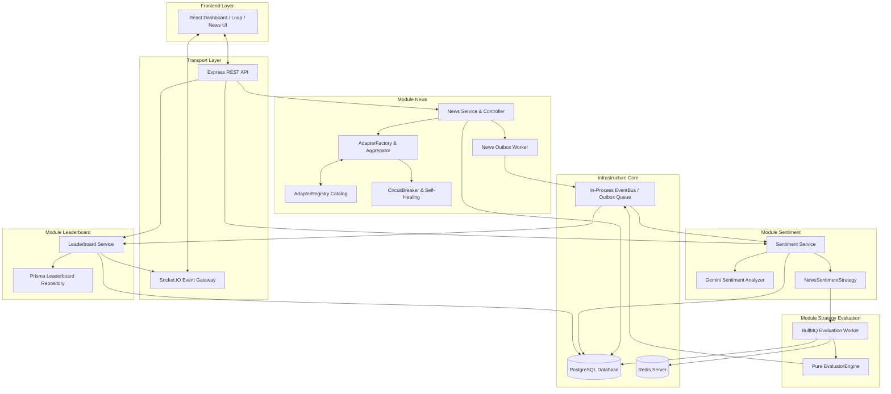

# Đặc tả Kiến trúc Chi tiết 4 Module Core
## News Crawler, Sentiment Analysis, Strategy Evaluation, & Leaderboard Realtime

> **Hệ thống Crypto Strategy Lab – Đồ án Software Architecture**

---

## 📋 Mục lục

1. [Tổng quan Kiến trúc Tổng thể](#1-tổng-quan-kiến-trúc-tổng-thể)
2. [Module 1 – News Crawler & Extraction Engine](#2-module-1--news-crawler--extraction-engine)
   - [2.1 Các Design Patterns Cốt lõi (6 Architectural Patterns)](#21-các-design-patterns-cốt-lõi-6-architectural-patterns)
   - [2.2 Phân tích Phối hợp giữa AdapterRegistry và AdapterFactory](#22-phân-tích-phối-hợp-giữa-adapterregistry-và-adapterfactory)
   - [2.3 Các Loại News Provider (NewsAPI, RSS, HTML Scraper)](#23-các-loại-news-provider-newsapi-rss-html-scraper)
   - [2.4 Đáp ứng Functional & Non-Functional Requirements](#24-đáp-ứng-functional--non-functional-requirements)
   - [2.5 Phân tích Trade-offs (Đánh đổi & Giải pháp)](#25-phân-tích-trade-offs-đánh-đổi--giải-pháp)
   - [2.6 Chi tiết Cấu trúc File & Trách nhiệm (Tất cả 15 File Hạ tầng)](#26-chi-tiết-cấu-trúc-file--trách-nhiệm-tất-cả-15-file-hạ-tầng)
   - [2.7 Hướng dẫn 4 Bước Thêm một Nguồn Crawl News Mới](#27-hướng-dẫn-4-bước-thêm-một-nguồn-crawl-news-mới)
3. [Module 2 – Sentiment Analysis & Strategy Integration](#3-module-2--sentiment-analysis--strategy-integration)
   - [3.1 Architectural Patterns](#31-architectural-patterns)
   - [3.2 Đáp ứng Functional & Non-Functional Requirements](#32-đáp-ứng-functional--non-functional-requirements)
   - [3.3 Phân tích Trade-offs (Đánh đổi)](#33-phân-tích-trade-offs-đánh-đổi)
   - [3.4 Chi tiết Cấu trúc File & Trách nhiệm](#34-chi-tiết-cấu-trúc-file--trách-nhiệm)
4. [Module 3 – Strategy Evaluation Engine](#4-module-3--strategy-evaluation-engine)
   - [4.1 Architectural Patterns](#41-architectural-patterns)
   - [4.2 Đáp ứng Functional & Non-Functional Requirements](#42-đáp-ứng-functional--non-functional-requirements)
   - [4.3 Phân tích Trade-offs (Đánh đổi)](#43-phân-tích-trade-offs-đánh-đổi)
   - [4.4 Chi tiết Cấu trúc File & Trách nhiệm](#44-chi-tiết-cấu-trúc-file--trách-nhiệm)
5. [Module 4 – Leaderboard & Realtime Stream](#5-module-4--leaderboard--realtime-stream)
   - [5.1 Architectural Patterns](#51-architectural-patterns)
   - [5.2 Đáp ứng Functional & Non-Functional Requirements](#52-đáp-ứng-functional--non-functional-requirements)
   - [5.3 Phân tích Trade-offs (Đánh đổi)](#53-phân-tích-trade-offs-đánh-đổi)
   - [5.4 Chi tiết Cấu trúc File & Trách nhiệm](#54-chi-tiết-cấu-trúc-file--trách-nhiệm)
6. [Luồng Vận hành Thực tế (End-to-End Practical Example)](#6-luồng-vận-hành-thực-tế-end-to-end-practical-example)

---

## 1. Tổng quan Kiến trúc Tổng thể

Hệ thống **Crypto Strategy Lab** được thiết kế theo nguyên lý **Clean Architecture** và **Domain-Driven Design (DDD)** nhằm đáp ứng các thuộc tính chất lượng phần mềm quan trọng: **Khả năng Mở rộng (Scalability), Khả năng Thay đổi (Modifiability), Độ chịu lỗi (Fault Tolerance) và Tính Bảo trì (Maintainability)**.



---

## 2. Module 1 – News Crawler & Extraction Engine

Module News chịu trách nhiệm tự động cào tin tức từ đa nguồn, chuẩn hóa dữ liệu về định dạng thống nhất `NewsItem`, lưu cơ sở dữ liệu và phát sự kiện sang hệ thống phân tích Sentiment.

### 2.1 Các Design Patterns Cốt lõi (6 Architectural Patterns)

1. **Adapter Pattern** ([`NewsProviderAdapter`](file:///e:/Documents/HCMUS/Semester3_Year3/Kiến%20trúc%20phần%20mềm/crypto-strategy-lab/backend/src/modules/news/domain/news.entity.ts)):
   - Chuẩn hóa giao diện thu thập dữ liệu tin tức. Mọi nguồn tin (từ REST API JSON, XML RSS Feed đến HTML Scraper) đều phải triển khai chung giao diện:
     ```typescript
     export interface NewsProviderAdapter {
       providerCode: string;
       fetchLatestNews(symbol?: string): Promise<Omit<NewsItem, "providerId">[]>;
     }
     ```
2. **Registry Pattern** ([`AdapterRegistry`](file:///e:/Documents/HCMUS/Semester3_Year3/Kiến%20trúc%20phần%20mềm/crypto-strategy-lab/backend/src/modules/news/infrastructure/adapter-registry.ts)):
   - Kho đăng ký dạng **Singleton Catalog** lưu vết tất cả các Adapter hiện có kèm metadata (code, priority, required API key, status enabled/disabled). Giúp hệ thống bật/tắt động bất kỳ nguồn tin nào tại runtime thông qua API Admin mà không cần restart server.
3. **Factory Method Pattern** ([`adapter-factory.ts`](file:///e:/Documents/HCMUS/Semester3_Year3/Kiến%20trúc%20phần%20mềm/crypto-strategy-lab/backend/src/modules/news/infrastructure/adapter-factory.ts)):
   - Trừu tượng hóa quá trình tạo đối tượng tin tức (`buildNewsAdapter()`). Đọc cấu hình biến môi trường (`NEWS_PROVIDERS`, `NEWSDATA_API_KEY`,...) để quyết định Adapter nào được kích hoạt.
4. **Composite Pattern** ([`AggregatingNewsAdapter`](file:///e:/Documents/HCMUS/Semester3_Year3/Kiến%20trúc%20phần%20mềm/crypto-strategy-lab/backend/src/modules/news/infrastructure/aggregating-news.adapter.ts)):
   - Gom nhiều Adapter độc lập thành **một Adapter tổng duy nhất**. Khi gọi `fetchLatestNews()`, nó phân tán yêu cầu cào tin song song tới tất cả nguồn qua `Promise.allSettled()`, khử trùng lặp (Deduplication) theo URL & Title Hash, và sắp xếp tin mới nhất lên đầu.
5. **Circuit Breaker Pattern** ([`circuit-breaker.ts`](file:///e:/Documents/HCMUS/Semester3_Year3/Kiến%20trúc%20phần%20mềm/crypto-strategy-lab/backend/src/modules/news/infrastructure/circuit-breaker.ts)):
   - Máy trạng thái ngắt mạch (`CLOSED` $\rightarrow$ `OPEN` $\rightarrow$ `HALF_OPEN`). Nếu một nguồn tin bị sập hoặc dính Rate Limit (3 lần thất bại liên tiếp), Circuit Breaker ngắt kết nối nguồn đó trong 60 giây (Fast-fail) để bảo vệ toàn hệ thống không bị ngơ.
6. **Transactional Outbox Pattern** ([`news-outbox.worker.ts`](file:///e:/Documents/HCMUS/Semester3_Year3/Kiến%20trúc%20phần%20mềm/crypto-strategy-lab/backend/src/modules/news/infrastructure/news-outbox.worker.ts)):
   - Đảm bảo tính toàn vẹn sự kiện: Tin tức lưu DB và sự kiện Outbox (`QueueJob`) được ghi trong cùng **1 Prisma Transaction**. Worker chạy ngầm sẽ đọc các job `PENDING` để phát sang EventBus và Socket.IO.

---

### 2.2 Phân tích Phối hợp giữa AdapterRegistry và AdapterFactory

| Tiêu chí | `AdapterRegistry` (Catalog) | `adapter-factory.ts` (Bootstrapper & Factory) |
| :--- | :--- | :--- |
| **Bản chất** | In-Process Singleton State Registry. | Creational Function & Entry point khởi tạo. |
| **Trách nhiệm** | Lưu danh sách đăng ký, kiểm tra API key, quản lý bật/tắt (enabled/disabled) và thứ tự ưu tiên (priority). | Đọc `.env`, gọi `bootstrapRegistry()`, lọc nguồn active và đóng gói thành `AggregatingNewsAdapter`. |
| **Thời điểm chạy** | Duy trì suốt vòng đời ứng dụng (In-Memory). | Chạy lúc Boot Server (gọi từ `news.container.ts`). |
| **Lợi ích Clean Architecture** | Tách biệt hoàn toàn việc lưu giữ trạng thái Adapter với logic tạo đối tượng. | Tầng Application (`NewsService`) chỉ nhận 1 adapter duy nhất qua DI. |

---

### 2.3 Các Loại News Provider (NewsAPI, RSS, HTML Scraper)

Module News hỗ trợ 3 nhóm nguồn tin tức chính:

```
                          ┌───────────────────────────┐
                          │   NewsProviderAdapter     │
                          └─────────────┬─────────────┘
                                        │
        ┌───────────────────────────────┼───────────────────────────────┐
        ▼                               ▼                               ▼
┌───────────────┐               ┌───────────────┐               ┌───────────────┐
│   NewsAPI     │               │   RSS Feed    │               │  HTML Scraper │
│ (Structured)  │               │ (XML Syndic)  │               │(Web Scraping) │
└───────┬───────┘               └───────┬───────┘               └───────┬───────┘
        │                               │                               │
  • NewsData.io                   • CoinDesk RSS                  • HtmlNewsAdapter
  • CryptoCompare                 • Cointelegraph RSS             • LLM Template
  • CryptoPanic                   • Bitcoin Magazine              • Self-Healing
```

1. **NewsAPI (Structured REST APIs)**:
   - *Ví dụ*: `NewsDataNewsAdapter`, `CryptoCompareNewsAdapter`, `CryptopanicNewsAdapter`.
   - *Đặc điểm*: Dữ liệu JSON có cấu trúc chuẩn, độ tin cậy cao, kèm mã coin symbols sẵn. Yêu cầu có **API Key cá nhân** cấu hình trong `.env`.
2. **RSS Feeds (XML Syndication Feeds)**:
   - *Ví dụ*: `CoinDeskRssAdapter`, `CointelegraphRssAdapter`, `BitcoinMagazineRssAdapter`.
   - *Đặc điểm*: Dữ liệu phát hành XML công khai từ các tòa soạn báo. **Miễn phí 100%**, **không cần API Key**, cào tin cực nhanh. Tự động bật mặc định nếu không cấu hình `NEWS_PROVIDERS`.
3. **HTML Scraper (Web Scraping)**:
   - *Ví dụ*: `HtmlNewsAdapter` (kết hợp Cheerio + DOM Selector).
   - *Đặc điểm*: Dùng cào tin từ các website báo không có API hay RSS. Tự động dùng Gemini AI để tự sinh CSS Selector (`llm-extraction.template-manager.ts`) và tự phục hồi (`self-healing.orchestrator.ts`) khi DOM báo thay đổi.

---

### 2.4 Đáp ứng Functional & Non-Functional Requirements

- **FR-050 $\rightarrow$ FR-055**: Thu thập, chuẩn hóa `NewsItem`, lưu PostgreSQL, hiển thị tin tức trực quan trên UI.
- **NFR-004 (News Provider Extensibility)**: Thêm bất kỳ nguồn tin mới nào (API/RSS/Scraper) chỉ cần viết thêm 1 class triển khai `NewsProviderAdapter` và đăng ký trong Registry.
- **NFR-019 (News Failure Isolation)**: Lỗi cào tin từ một báo hoặc mất kết nối mạng được cách ly bởi Circuit Breaker và `Promise.allSettled()`; không làm gián đoạn hệ thống.

---

### 2.5 Phân tích Trade-offs (Đánh đổi & Giải pháp)

| Ưu điểm Kiến trúc | Trade-off (Sự Đánh đổi) | Giải pháp Khắc phục |
| :--- | :--- | :--- |
| **Composite Aggregator** giúp cào song song từ hàng chục nguồn cùng lúc. | Có nguy cơ bị trùng lặp bài báo xuất bản trên nhiều trang khác nhau. | Thuật toán `dedupeNews()` khử trùng 2 lớp: theo `UrlHost+Path` và theo `Normalized Title Hash`. |
| **Outbox Pattern** đảm bảo không bao giờ mất sự kiện tin tức. | Tăng nhẹ lượng ghi I/O vào bảng `QueueJob` của PostgreSQL. | Worker tự động xoá hoặc đánh dấu `PUBLISHED` cho các job cũ định kỳ. |
| **LLM Self-Healing** tự sửa CSS Selector khi báo đổi giao diện. | Chi phí Token API và Latency khi gọi Gemini API. | Cache Selector Template theo version (`v1.4.2`). Chỉ kích hoạt Gemini khi tỷ lệ trích xuất lỗi $> 10\%$. |

---

### 2.6 Chi tiết Cấu trúc File & Trách nhiệm (Tất cả 15 File Hạ tầng)

#### 🏢 Domain Layer (`backend/src/modules/news/domain/`)
- [`news.entity.ts`](file:///e:/Documents/HCMUS/Semester3_Year3/Kiến%20trúc%20phần%20mềm/crypto-strategy-lab/backend/src/modules/news/domain/news.entity.ts): Định nghĩa `NewsItem`, `NewsProviderEntity`, interface `NewsProviderAdapter` và `NewsRepository`.
- [`extraction.entity.ts`](file:///e:/Documents/HCMUS/Semester3_Year3/Kiến%20trúc%20phần%20mềm/crypto-strategy-lab/backend/src/modules/news/domain/extraction.entity.ts): Định nghĩa entity template trích xuất DOM, kết quả kiểm định chất lượng (`QualityValidationResult`).

#### 🛠️ Infrastructure Layer (`backend/src/modules/news/infrastructure/`)
1. [`adapter-registry.ts`](file:///e:/Documents/HCMUS/Semester3_Year3/Kiến%20trúc%20phần%20mềm/crypto-strategy-lab/backend/src/modules/news/infrastructure/adapter-registry.ts): Singleton kho lưu trữ danh sách các Adapter, quản lý ưu tiên (priority) và runtime enable/disable.
2. [`adapter-factory.ts`](file:///e:/Documents/HCMUS/Semester3_Year3/Kiến%20trúc%20phần%20mềm/crypto-strategy-lab/backend/src/modules/news/infrastructure/adapter-factory.ts): Đọc biến môi trường `.env`, kích hoạt registry và tạo ra `AggregatingNewsAdapter`.
3. [`aggregating-news.adapter.ts`](file:///e:/Documents/HCMUS/Semester3_Year3/Kiến%20trúc%20phần%20mềm/crypto-strategy-lab/backend/src/modules/news/infrastructure/aggregating-news.adapter.ts): Composite Adapter thực thi cào song song, merge và dedupe tin tức.
4. [`newsdata-news.adapter.ts`](file:///e:/Documents/HCMUS/Semester3_Year3/Kiến%20trúc%20phần%20mềm/crypto-strategy-lab/backend/src/modules/news/infrastructure/newsdata-news.adapter.ts): Adapter kết nối API của NewsData.io.
5. [`cryptocompare-news.adapter.ts`](file:///e:/Documents/HCMUS/Semester3_Year3/Kiến%20trúc%20phần%mềm/crypto-strategy-lab/backend/src/modules/news/infrastructure/cryptocompare-news.adapter.ts): Adapter kết nối API của CryptoCompare.
6. [`cryptopanic-news.adapter.ts`](file:///e:/Documents/HCMUS/Semester3_Year3/Kiến%20trúc%20phần%mềm/crypto-strategy-lab/backend/src/modules/news/infrastructure/cryptopanic-news.adapter.ts): Adapter kết nối API của CryptoPanic.
7. [`rss-feed.adapters.ts`](file:///e:/Documents/HCMUS/Semester3_Year3/Kiến%20trúc%20phần%mềm/crypto-strategy-lab/backend/src/modules/news/infrastructure/rss-feed.adapters.ts): Tập hợp các Adapter cào RSS Feeds (CoinDesk, Cointelegraph, Bitcoin Magazine).
8. [`rss-news.adapter.ts`](file:///e:/Documents/HCMUS/Semester3_Year3/Kiến%20trúc%20phần%mềm/crypto-strategy-lab/backend/src/modules/news/infrastructure/rss-news.adapter.ts): Adapter mock tin tức giả phục vụ dev/testing offline.
9. [`html-news.adapter.ts`](file:///e:/Documents/HCMUS/Semester3_Year3/Kiến%20trúc%20phần%mềm/crypto-strategy-lab/backend/src/modules/news/infrastructure/html-news.adapter.ts): Adapter cào tin web HTML bằng Cheerio.
10. [`circuit-breaker.ts`](file:///e:/Documents/HCMUS/Semester3_Year3/Kiến%20trúc%20phần%mềm/crypto-strategy-lab/backend/src/modules/news/infrastructure/circuit-breaker.ts): Lớp ngắt mạch bảo vệ chống quá tải / sập mạng từ nguồn tin bên ngoài.
11. [`self-healing.orchestrator.ts`](file:///e:/Documents/HCMUS/Semester3_Year3/Kiến%20trúc%20phần%mềm/crypto-strategy-lab/backend/src/modules/news/infrastructure/self-healing.orchestrator.ts): Tự động phát hiện DOM lỗi và trigger Gemini sửa selector.
12. [`llm-extraction.template-manager.ts`](file:///e:/Documents/HCMUS/Semester3_Year3/Kiến%20trúc%20phần%mềm/crypto-strategy-lab/backend/src/modules/news/infrastructure/llm-extraction.template-manager.ts): Quản lý Prompt templates và giao tiếp với Gemini API.
13. [`news-crawler.queue.ts`](file:///e:/Documents/HCMUS/Semester3_Year3/Kiến%20trúc%20phần%mềm/crypto-strategy-lab/backend/src/modules/news/infrastructure/news-crawler.queue.ts): Hàng chờ CronJob định kỳ trigger cào tin.
14. [`news-outbox.worker.ts`](file:///e:/Documents/HCMUS/Semester3_Year3/Kiến%20trúc%20phần%mềm/crypto-strategy-lab/backend/src/modules/news/infrastructure/news-outbox.worker.ts): Polling worker đọc Outbox event từ DB và phát sang Socket/EventBus.
15. [`prisma-news.repository.ts`](file:///e:/Documents/HCMUS/Semester3_Year3/Kiến%20trúc%20phần%mềm/crypto-strategy-lab/backend/src/modules/news/infrastructure/prisma-news.repository.ts): Thực thi truy vấn PostgreSQL qua Prisma ORM.

---

### 2.7 Hướng dẫn 4 Bước Thêm một Nguồn Crawl News Mới

1. **Bước 1**: Tạo file Adapter mới triển khai `NewsProviderAdapter` (ví dụ `decrypt-news.adapter.ts`).
2. **Bước 2**: Đăng ký trong `bootstrapRegistry()` tại [`adapter-factory.ts`](file:///e:/Documents/HCMUS/Semester3_Year3/Kiến%20trúc%20phần%mềm/crypto-strategy-lab/backend/src/modules/news/infrastructure/adapter-factory.ts) với `code: "decrypt"`.
3. **Bước 3**: Thêm code `"decrypt"` vào biến môi trường `NEWS_PROVIDERS` trong `.env`.
4. **Bước 4**: Viết unit test cho adapter mới. `AggregatingNewsAdapter` sẽ tự động phát hiện và cào song song nguồn mới này mà **không cần sửa 1 dòng code nào ở tầng Application hay Controller**!

---

## 3. Module 2 – Sentiment Analysis & Strategy Integration

### 3.1 Architectural Patterns
1. **Event-Driven Architecture (EDA)**: Tự động lắng nghe sự kiện `NewsCollected` từ EventBus để tiến hành phân tích Sentiment ngầm.
2. **Strategy Pattern / Plugin Architecture**: Biến kết quả Sentiment thành chỉ báo tham gia trực tiếp vào Strategy Engine thông qua class **`NewsSentimentStrategy`**.
3. **In-Memory LRU Caching**: Cache kết quả tổng hợp Sentiment (`SentimentSummary`) trong 30 giây để giảm tải truy vấn DB khi Frontend render.

### 3.2 Đáp ứng Requirements (FRs & NFRs)
- **FR-056 $\rightarrow$ FR-060**: Phân tích Sentiment tin tức thành `POSITIVE`, `NEUTRAL`, `NEGATIVE` kèm điểm số (`score` từ -1.0 đến +1.0).
- **NFR-005 & AC-08 (Sentiment Model Extensibility)**: Dễ dàng thay thế Gemini API bằng OpenAI, HuggingFace hoặc Local ML model thông qua interface `SentimentAnalyzer`.
- **Section 30 Spec**: Cho phép kết hợp `NewsSentimentStrategy` với các chiến lược kỹ thuật khác (`MA + RSI + News Sentiment`) thành **Composite Strategy**.

### 3.3 Phân tích Trade-offs (Đánh đổi)
| Ưu điểm Kiến trúc | Trade-off (Sự Đánh đổi) | Giải pháp Khắc phục |
| :--- | :--- | :--- |
| Giao tiếp Event giúp Sentiment Service không làm chậm tốc độ crawl tin tức. | Eventual Consistency: Tin tức vừa crawl sẽ có độ trễ nhỏ vài giây trước khi có điểm Sentiment. | Tự động chạy **Backfill** ngầm cho các tin tức chưa phân tích và broadcast qua Socket.IO. |
| Sentiment hoạt động như 1 Strategy chuẩn, tương thích hoàn toàn với Backtester & Combination. | Dữ liệu tin tức quá khứ (Historical News) ít hơn Candlesticks. | Sử dụng dữ liệu Sentiment có sẵn trong DB hoặc giả lập theo phân phối khi backtest khoảng thời gian xa. |

### 3.4 Chi tiết Cấu trúc File & Trách nhiệm

#### Domain Layer
- [`backend/src/modules/sentiment/domain/sentiment.entity.ts`](file:///e:/Documents/HCMUS/Semester3_Year3/Kiến%20trúc%20phần%mềm/crypto-strategy-lab/backend/src/modules/sentiment/domain/sentiment.entity.ts): Định nghĩa kiểu dữ liệu `SentimentRecord`, `SentimentAnalysisResult`, `SentimentAnalyzer`.

#### Infrastructure Layer
- [`backend/src/modules/sentiment/infrastructure/gemini-sentiment.analyzer.ts`](file:///e:/Documents/HCMUS/Semester3_Year3/Kiến%20trúc%20phần%mềm/crypto-strategy-lab/backend/src/modules/sentiment/infrastructure/gemini-sentiment.analyzer.ts): Gửi nội dung tin tức đến Gemini AI để phân loại cảm xúc.
- [`backend/src/modules/sentiment/infrastructure/prisma-sentiment.repository.ts`](file:///e:/Documents/HCMUS/Semester3_Year3/Kiến%20trúc%20phần%mềm/crypto-strategy-lab/backend/src/modules/sentiment/infrastructure/prisma-sentiment.repository.ts): Thao tác với cơ sở dữ liệu Postgres.

#### Application, Strategy, & Presentation Layer
- [`backend/src/modules/sentiment/application/sentiment.service.ts`](file:///e:/Documents/HCMUS/Semester3_Year3/Kiến%20trúc%20phần%mềm/crypto-strategy-lab/backend/src/modules/sentiment/application/sentiment.service.ts): Đăng ký EventBus, xử lý phân tích và quản lý Cache.
- [`backend/src/modules/strategy/strategies/NewsSentimentStrategy.ts`](file:///e:/Documents/HCMUS/Semester3_Year3/Kiến%20trúc%20phần%mềm/crypto-strategy-lab/backend/src/modules/strategy/strategies/NewsSentimentStrategy.ts): Triển khai `Strategy` interface, phát tín hiệu BUY khi Sentiment $\ge +0.7$, SELL khi $\le -0.7$.
- [`backend/src/modules/sentiment/presentation/sentiment.controller.ts`](file:///e:/Documents/HCMUS/Semester3_Year3/Kiến%20trúc%20phần%mềm/crypto-strategy-lab/backend/src/modules/sentiment/presentation/sentiment.controller.ts) & [`sentiment.routes.ts`](file:///e:/Documents/HCMUS/Semester3_Year3/Kiến%20trúc%20phần%mềm/crypto-strategy-lab/backend/src/modules/sentiment/presentation/sentiment.routes.ts): REST Endpoints (`GET /api/sentiment/summary`).

---

## 4. Module 3 – Strategy Evaluation Engine

### 4.1 Architectural Patterns
1. **Pure Functional Domain Engine**: `EvaluatorEngine` là một Pure Class, không chứa bất kỳ phụ thuộc I/O (không DB, không Express, không Redis). Điều này giúp việc Unit Test đạt độ chính xác 100% và tốc độ tính toán cực nhanh.
2. **Producer-Consumer Worker Pattern (BullMQ Queue)**: Việc tính toán các chỉ số tài chính của hàng ngàn giao dịch được đưa vào BullMQ Queue để Worker xử lý song song.
3. **Trade-Count Penalty Mechanism**: Tự động giảm điểm quá khớp với công thức $\text{Score} \times \sqrt{N / 30}$ nếu số giao dịch $N < 30$.

### 4.2 Đáp ứng Requirements (FRs & NFRs)
- **FR-038 $\rightarrow$ FR-043**: Đánh giá đa chỉ số: `Total Return`, `Win Rate`, `Max Drawdown`, `Number of Trades`, `Sharpe Ratio`, `Profit Factor`, `Calmar Ratio`, `Sortino Ratio`.
- **AC-05 & AC-06**: Tách biệt hoàn toàn giữa `EvaluatorEngine`, `Backtester`, và `Strategy Implementation`.
- **NFR-007 & NFR-008 (Backtesting Scalability)**: Dễ dàng tăng số lượng BullMQ Worker để scale ngang (Horizontal Scaling) khi số lượng chiến lược cần backtest tăng lên hàng chục ngàn.

### 4.3 Phân tích Trade-offs (Đánh đổi)
| Ưu điểm Kiến trúc | Trade-off (Sự Đánh đổi) | Giải pháp Khắc phục |
| :--- | :--- | :--- |
| Pure Domain Engine giúp việc tính toán không bao giờ bị nghẽn I/O. | Phải nạp danh sách `TradeInput` vào bộ nhớ RAM của Worker khi tính toán. | Chỉ truyền các trường cần thiết trong mảng Trade (giảm dung lượng RAM per job). |
| Sử dụng BullMQ Queue tránh treo main thread của server Node.js. | Đòi hỏi phải cài đặt và duy trì Redis Server. | Cấu hình tự động dọn dẹp (clean stale jobs) khi boot server. |

### 4.4 Chi tiết Cấu trúc File & Trách nhiệm

#### Domain Layer
- [`backend/src/modules/evaluation/domain/evaluator.engine.ts`](file:///e:/Documents/HCMUS/Semester3_Year3/Kiến%20trúc%20phần%mềm/crypto-strategy-lab/backend/src/modules/evaluation/domain/evaluator.engine.ts): Thuật toán thuần tính toán 12 chỉ số tài chính định lượng chuyên nghiệp và đường cong tài sản (`equityCurve`).
- [`backend/src/modules/evaluation/domain/evaluation.entity.ts`](file:///e:/Documents/HCMUS/Semester3_Year3/Kiến%20trúc%20phần%mềm/crypto-strategy-lab/backend/src/modules/evaluation/domain/evaluation.entity.ts): Định nghĩa kiểu dữ liệu chỉ số và trọng số đánh giá.

#### Infrastructure Layer
- [`backend/src/modules/evaluation/infrastructure/evaluation.worker.ts`](file:///e:/Documents/HCMUS/Semester3_Year3/Kiến%20trúc%20phần%mềm/crypto-strategy-lab/backend/src/modules/evaluation/infrastructure/evaluation.worker.ts): BullMQ Background Worker tiêu thụ job đánh giá và lưu kết quả vào DB.
- [`backend/src/modules/evaluation/infrastructure/evaluation.queue.ts`](file:///e:/Documents/HCMUS/Semester3_Year3/Kiến%20trúc%20phần%mềm/crypto-strategy-lab/backend/src/modules/evaluation/infrastructure/evaluation.queue.ts): Đẩy job đánh giá vào hàng đợi Redis với Idempotency key.

#### Application & Presentation Layer
- [`backend/src/modules/evaluation/application/evaluation.service.ts`](file:///e:/Documents/HCMUS/Semester3_Year3/Kiến%20trúc%20phần%mềm/crypto-strategy-lab/backend/src/modules/evaluation/application/evaluation.service.ts): Tiếp nhận sự kiện `BacktestCompleted`, gửi job vào Queue và đọc kết quả đánh giá.

---

## 5. Module 4 – Leaderboard & Realtime Stream

### 5.1 Architectural Patterns
1. **Repository Pattern with Dynamic Sorting**: `PrismaLeaderboardRepository` hỗ trợ query Top-K linh hoạt theo các tiêu chí khác nhau (`overallScore`, `totalReturn`, `winRate`, `maxDrawdown`, `sharpeRatio`).
2. **Historical Snapshot Pattern (`RankingHistory`)**: Mỗi khi thứ hạng thay đổi, hệ thống ghi nhận vết rank vào bảng `RankingHistory` để phục vụ biểu đồ phong độ chiến lược.
3. **Hybrid REST + Socket.IO Realtime Pattern**:
   - **Initial Load**: HTTP GET lấy nhanh dữ liệu từ PostgreSQL.
   - **Realtime Updates**: Socket.IO phát event `LeaderboardUpdated` để Frontend tự động nảy số mà không cần F5.

### 5.2 Đáp ứng Requirements (FRs & NFRs)
- **FR-044 $\rightarrow$ FR-049**: Hiển thị Top-K, xếp hạng, duy trì lịch sử rank, hỗ trợ sắp xếp đa tiêu chí.
- **AC-09**: Leaderboard hoàn toàn không phụ thuộc trực tiếp vào Search Engine hay Backtester. Nó nhận dữ liệu thông qua event `StrategyEvaluated`.
- **NFR-032 (Real-time Feedback)**: Phát tín hiệu đẩy dữ liệu trực tiếp xuống giao diện Continuous Loop (`/loop`) và Leaderboard Page.

### 5.3 Phân tích Trade-offs (Đánh đổi)
| Ưu điểm Kiến trúc | Trade-off (Sự Đánh đổi) | Giải pháp Khắc phục |
| :--- | :--- | :--- |
| Lưu lịch sử `RankingHistory` giúp theo dõi sự tiến hóa của thuật toán qua thời gian. | Số lượng dòng trong bảng `RankingHistory` tăng nhanh theo số lượt backtest. | Chỉ ghi snapshot khi rank của chiến lược có sự thay đổi thực sự và giới hạn query 50 bản ghi gần nhất. |
| Socket.IO giúp UI nhảy rank cực kỳ mượt mà. | Khi có hàng ngàn client kết nối đồng thời có thể gây quá tải WebSocket. | Broadcast payload gọn nhẹ (chỉ gửi Top-10 cập nhật). |

### 5.4 Chi tiết Cấu trúc File & Trách nhiệm

#### Domain & Infrastructure Layer
- [`backend/src/modules/leaderboard/domain/leaderboard.entity.ts`](file:///e:/Documents/HCMUS/Semester3_Year3/Kiến%20trúc%20phần%mềm/crypto-strategy-lab/backend/src/modules/leaderboard/domain/leaderboard.entity.ts): Định nghĩa kiểu dữ liệu item xếp hạng và bộ lọc.
- [`backend/src/modules/leaderboard/infrastructure/prisma-leaderboard.repository.ts`](file:///e:/Documents/HCMUS/Semester3_Year3/Kiến%20trúc%20phần%mềm/crypto-strategy-lab/backend/src/modules/leaderboard/infrastructure/prisma-leaderboard.repository.ts): Thao tác sắp xếp SQL, cập nhật rank và ghi vết `RankingHistory`.

#### Application, Presentation, & Frontend Layer
- [`backend/src/modules/leaderboard/application/leaderboard.service.ts`](file:///e:/Documents/HCMUS/Semester3_Year3/Kiến%20trúc%20phần%mềm/crypto-strategy-lab/backend/src/modules/leaderboard/application/leaderboard.service.ts): Lắng nghe `StrategyEvaluated`, tính lại rank, phát event `NewTopStrategyFound` và broadcast Socket `LeaderboardUpdated`.
- [`frontend/src/components/LeaderboardCard.tsx`](file:///e:/Documents/HCMUS/Semester3_Year3/Kiến%20trúc%20phần%mềm/crypto-strategy-lab/frontend/src/components/LeaderboardCard.tsx): Component UI hiển thị huy chương 🥇 🥈 🥉, phân biệt chỉ báo `MA (Fast)` / `MA (Slow)` / `RSI` / `Sentiment`, Profit (USDT) và Winrate.
- [`frontend/src/pages/Loop.tsx`](file:///e:/Documents/HCMUS/Semester3_Year3/Kiến%20trúc%20phần%mềm/crypto-strategy-lab/frontend/src/pages/Loop.tsx): Nhúng `LeaderboardCard` vào giao diện Continuous Loop để theo dõi tự động.

---

## 6. Luồng Vận hành Thực tế (End-to-End Practical Example)

Kịch bản thực tế: **Tự động crawl tin tức $\rightarrow$ Phân tích Sentiment bằng Gemini $\rightarrow$ Chạy Continuous Loop kết hợp chiến lược $\rightarrow$ Đánh giá chỉ số $\rightarrow$ Cập nhật Bảng xếp hạng Realtime.**

```mermaid
sequenceDiagram
    autonumber
    participant NC as News Crawler (AggregatingNewsAdapter)
    participant DB as Postgres DB
    participant EB as EventBus
    participant SS as Sentiment Service (Gemini)
    participant LOOP as Continuous Loop
    participant EVAL as BullMQ Evaluation Worker
    participant LB as Leaderboard Service
    participant FE as Frontend UI (Loop & Leaderboard)

    Note over NC, DB: 1. THU THẬP TIN TỨC & DEDUPLICATE (MODULE NEWS)
    NC->>NC: Crawl song song từ NewsData.io API + CoinDesk RSS
    NC->>NC: dedupeNews() lọc bài viết trùng URL / Title
    NC->>DB: Transaction: Lưu NewsItem + Ghi Outbox QueueJob
    NC->>EB: Publish Event "NewsCollected" (BTC News)

    Note over SS, DB: 2. PHÂN TÍCH SENTIMENT NGẦM (MODULE SENTIMENT)
    EB->>SS: Trigger handleNewsCollected()
    SS->>SS: Gọi Gemini API phân tích -> Điểm Sentiment: +0.85 (POSITIVE)
    SS->>DB: Lưu SentimentRecord (Score: +0.85)
    SS->>EB: Publish Event "SentimentAnalyzed"

    Note over LOOP, EVAL: 3. VÒNG LẶP CHẠY STRATEGY TỔ HỢP (MA + RSI + SENTIMENT)
    LOOP->>LOOP: Sinh Candidate Composite Strategy: "MA + RSI + News Sentiment"
    LOOP->>EVAL: Chạy Backtest & Đẩy Job vào Evaluation Queue
    EVAL->>EVAL: EvaluatorEngine tính toán (Return: +24.2%, Winrate: 68%, Sharpe: 1.85)
    EVAL->>EB: Publish Event "StrategyEvaluated"

    Note over LB, FE: 4. CẬP NHẬT BẢNG XẾP HẠNG & PHÁT REALTIME SOCKET
    EB->>LB: Trigger handleStrategyEvaluated()
    LB->>DB: Recalculate Ranks (Chiến lược mới vươn lên RANK #1 🥇)
    LB->>DB: Ghi snapshot vào RankingHistory
    LB->>EB: Publish Event "NewTopStrategyFound" (Cho Loop tiếp tục nhân giống)
    LB->>FE: Socket.IO Emit "LeaderboardUpdated"
    FE->>FE: Giao diện /loop tự động nảy số & nhảy thẻ MA (Fast) + MA (Slow) + Sentiment lên Top 1!
```

### 💡 Các bước diễn ra chi tiết từng giây:
1. **Giây 00**: `AggregatingNewsAdapter` cào song song bài báo mới *"Bitcoin surges as institutional adoption grows"* từ cả NewsData.io và CoinDesk RSS, khử trùng lặp qua Title hash.
2. **Giây 01**: Bài báo được lưu vào DB và Outbox Worker phát event `NewsCollected`.
3. **Giây 02**: `SentimentService` bắt event, gửi nội dung cho Gemini AI và tính được `sentimentScore = +0.85` (Rất tích cực).
4. **Giây 03**: `LoopOrchestratorRunner` lấy tín hiệu tích cực này kết hợp với `MovingAverageStrategy` và `RSIStrategy` thành tổ hợp `MA + RSI + News Sentiment`.
5. **Giây 04**: `BullMQEvaluationWorker` chạy ngầm, gọi `EvaluatorEngine` tính toán thu được Lợi nhuận `+$2,450 USDT`, Winrate `68.21%` và `overallScore = 84.5`.
6. **Giây 05**: `LeaderboardService` phát hiện chiến lược này có điểm cao nhất, đưa lên **Rank #1 🥇**, lưu vết lịch sử và bắn Socket event `LeaderboardUpdated`.
7. **Giây 05.1**: Màn hình của người dùng tại `http://localhost:5173/loop` lập tức nhảy thẻ **`MA (Fast)` + `MA (Slow)` + `Sentiment`** lên vị trí Top 1 rực rỡ kèm hiệu ứng mượt mà!
