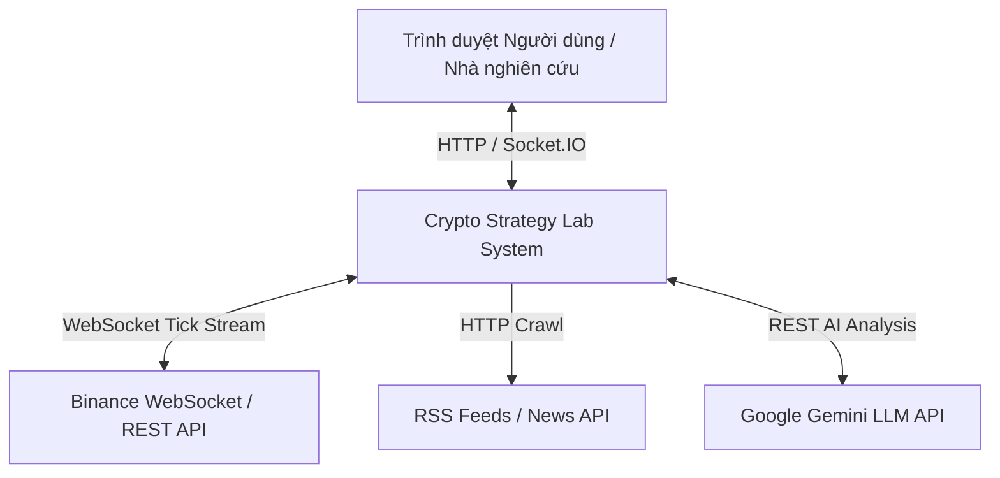
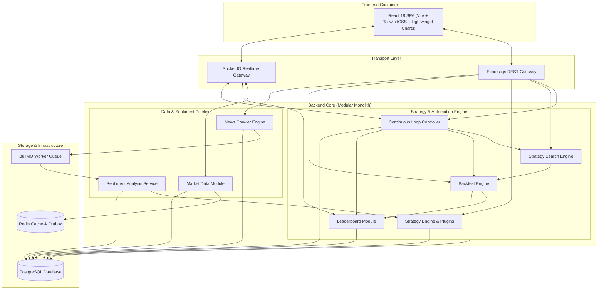
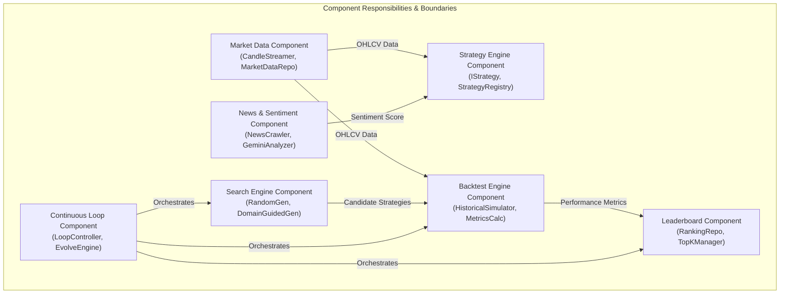
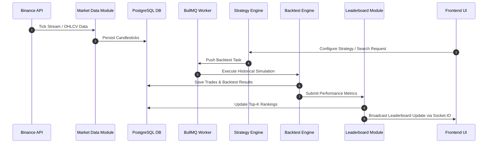
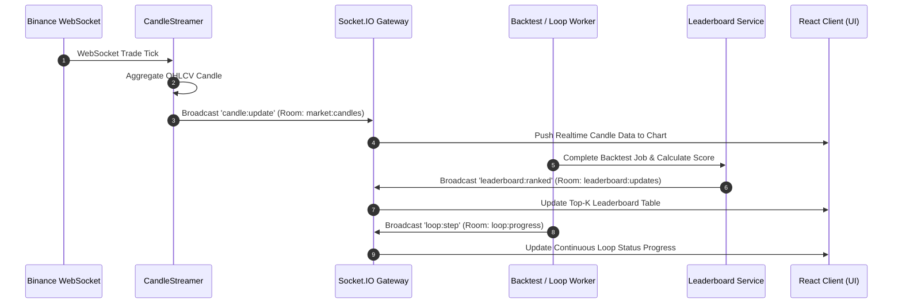
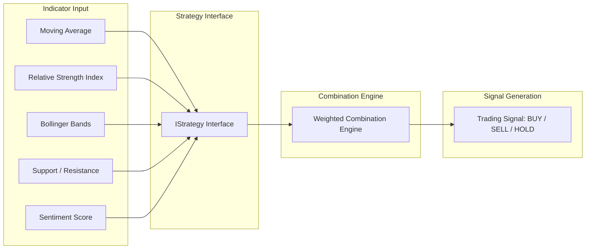
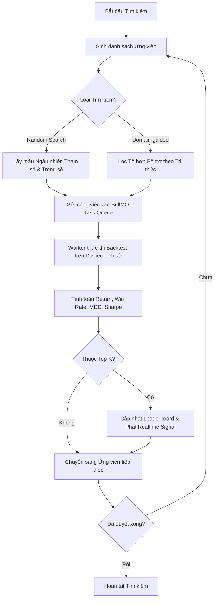

# Architecture Document - Crypto Strategy Lab

Đặc tả Kiến trúc Phần mềm Nền tảng Crypto Strategy Lab.

---

## 1. System Context (C4 Level 1)

Hệ thống **Crypto Strategy Lab** đứng ở vị trí trung tâm trong việc thu thập dữ liệu thị trường, tin tức xã hội, phân tích cảm xúc và tự động hóa thử nghiệm chiến lược giao dịch.

### Các Tác nhân và Hệ thống Bên ngoài:
1. **User (Nhà nghiên cứu / Trader)**: Tương tác qua giao diện Web React để cấu hình chỉ báo, chạy thuật toán tìm kiếm chiến lược, thực hiện backtest và theo dõi vòng lặp liên tục (Loop).
2. **Binance Exchange**: Nguồn cung cấp dữ liệu giá nến (OHLCV) theo thời gian thực qua giao thức WebSocket và dữ liệu lịch sử qua REST API.
3. **News Providers (RSS / News API)**: Cung cấp nguồn tin tức thị trường cryptocurrency theo dạng dòng sự kiện.
4. **Google Gemini LLM API**: Dịch vụ trí tuệ nhân tạo bên ngoài được tích hợp để phân tích định tính văn bản tin tức, trích xuất điểm số cảm xúc (Sentiment score) và thực thể liên quan.

---

## 2. Module / Container Decomposition (C4 Level 2)

Hệ thống Backend được xây dựng theo mô hình **Modular Monolith** kết hợp với kiến trúc hướng sự kiện (Event-Driven Architecture) và cơ chế xử lý bất đồng bộ qua Queue / Worker.

---

## 3. Component Responsibilities & Boundaries (C4 Level 3)

### 3.1 Market Data Module
- **Trách nhiệm**: Kết nối và duy trì kết nối WebSocket tới Binance/CoinGecko. Thu thập tick giá realtime và tổng hợp thành các cây nến (Candlestick) ở các khung thời gian: 1m, 5m, 15m, 1h, 4h, 1d.
- **Ranh giới (Boundary)**: Cung cấp giao diện `IMarketDataRepository` và `CandleStreamer` cho các module khác. Không phụ thuộc vào logic giao dịch hay chiến lược.

### 3.2 Strategy Engine & Plugin Architecture
- **Trách nhiệm**: Cung cấp giao diện chuẩn `IStrategy` và lớp cơ sở `BaseStrategy`. Cài đặt các chiến lược kỹ thuật cốt lõi:
  - Moving Average Crossover (MA)
  - Relative Strength Index (RSI)
  - Bollinger Bands (BB)
  - Support & Resistance (SR)
  - SentimentStrategy (Tích hợp điểm cảm xúc thị trường)
- **Cơ chế Plugin**: Cho phép đăng ký mới bất kỳ chiến lược nào qua `StrategyRegistry` mà không làm thay đổi mã nguồn hiện có (Open-Closed Principle).
- **Composite Strategy**: Kết hợp các tín hiệu đơn lẻ thành chiến lược phức hợp dựa trên trọng số (`WeightedCombinationStrategy`).

### 3.3 Strategy Search Engine
- **Trách nhiệm**: Tự động sinh ra không gian chiến lược  từ các  tham số và tổ hợp.
- **Thuật toán Tìm kiếm**:
  - **Random Search**: Lấy mẫu ngẫu nhiên tổ hợp tham số và trọng số.
  - **Domain-guided Search**: Sử dụng tri thức chuyên ngành để ưu tiên các cặp chỉ báo có tính bổ trợ cao (ví dụ: Trend-following MA kết hợp với Oscillator RSI).

### 3.4 Backtesting Engine
- **Trách nhiệm**: Mô phỏng khớp lệnh lịch sử dựa trên dữ liệu nến quá khứ.
- **Tính toán Chỉ số (Metrics)**:
  - Total Return (%)
  - Win Rate (%)
  - Max Drawdown - MDD (%)
  - Sharpe Ratio
  - Profit Factor & Total Trades

### 3.5 Leaderboard Module
- **Trách nhiệm**: Lưu trữ, quản lý và xếp hạng danh sách Top-K chiến lược hiệu quả nhất dựa trên chỉ số tổng hợp (Composite Score / Sharpe Ratio).
- **Cập nhật Realtime**: Phát sự kiện qua Socket.IO để cập nhật giao diện người dùng ngay lập tức khi một chiến lược mới ghi điểm cao hơn.

### 3.6 News Crawler Engine & Sentiment Analysis
- **Trách nhiệm**:
  - `News Crawler`: Thu thập bài viết từ RSS / NewsAPI theo chu kỳ. Có cơ chế `CircuitBreaker` tự khắc phục sự cố khi nguồn tin bị hỏng.
  - `Sentiment Analysis Service`: Gửi nội dung tin tức tới Google Gemini LLM API để phân loại cảm xúc (Positive, Neutral, Negative) và trả về điểm số từ -1.0 đến +1.0.

### 3.7 Continuous Strategy Loop Engine
- **Trách nhiệm**: Điều phối chu trình tự động hóa khép kín:
  1. Generate: Sinh ra tập chiến lược ứng viên mới.
  2. Execute: Gửi công việc backtest vào Queue.
  3. Measure: Thu thập kết quả và tính điểm hiệu năng.
  4. Rank: Cập nhật thứ hạng vào Leaderboard.
  5. Evolve & Verify: Lựa chọn các mẫu chiến lược tốt nhất để lai ghép hoặc tinh chỉnh cho vòng lặp tiếp theo.

---

## 4. Data Flow

### Mô tả Dòng dữ liệu:
1. **Dữ liệu Nến**: Nhận từ Binance WebSocket -> Chuẩn hóa định dạng OHLCV -> Lưu trữ dài hạn trong PostgreSQL.
2. **Dữ liệu Tin tức & Cảm xúc**: Crawl bài báo  -> Worker gọi Gemini API -> Lưu điểm Sentiment theo mốc thời gian -> Cung cấp cho SentimentStrategy.
3. **Dữ liệu Đánh giá Chiến lược**: Chiến lược tạo ra tín hiệu (1: BUY, -1: SELL, 0: HOLD) -> Engine giả lập khớp lệnh -> Lưu chi tiết giao dịch (Trades) -> Xuất chỉ số thống kê -> Đẩy lên Leaderboard.

---

## 5. Realtime Flow (Socket.IO Stream)

Hệ thống sử dụng **Socket.IO Gateway** để quản lý các kênh kết nối thời gian thực:

1. **Kênh `market:candles`**:
   - Phát các sự kiện `candle:update` mỗi khi có cây nến mới hoặc giá nến đang chạy thay đổi.
   - Frontend hiển thị biểu đồ nến realtime mượt mà mà không cần re-fetch API.

2. **Kênh `leaderboard:updates`**:
   - Phát sự kiện `leaderboard:ranked` mỗi khi một backtest hoàn tất có điểm số nằm trong Top-K.
   - Bảng xếp hạng trên UI lập tức thay đổi vị trí mượt mà với hoạt ảnh highlight.

3. **Kênh `loop:progress`**:
   - Phát sự kiện `loop:step` thông báo tiến trình của vòng lặp Continuous Loop.

---

## 6. Strategy Flow & Plugin System

### Thuật toán Kết hợp Chiến lược (Composite Combination):
Cho $N$ chiến lược con $S_1, S_2, ..., S_N$ với trọng số tương ứng $w_1, w_2, ..., w_N$ (sao cho $\sum w_i = 1$) và tín hiệu từ mỗi chiến lược $s_i \in \{-1, 0, 1\}$:

Dạng tín hiệu tổng hợp:
$$S_{composite} = \sum_{i=1}^{N} w_i \cdot s_i$$

Nếu $S_{composite} \ge \text{Threshold}_{buy}$ -> Quyết định BUY (1).  
Nếu $S_{composite} \le -\text{Threshold}_{sell}$ -> Quyết định SELL (-1).  
Ngược lại -> Quyết định HOLD (0).

---

## 7. Search & Backtest Flow

### Các Chỉ số Đánh giá Hiệu năng (Metrics Calculation):
1. **Total Return**:
   $$\text{Return} = \frac{V_{final} - V_{initial}}{V_{initial}} \times 100\%$$
2. **Win Rate**:
   $$\text{Win Rate} = \frac{\text{Số giao dịch có lợi nhuận}}{\text{Tổng số giao dịch}} \times 100\%$$
3. **Max Drawdown (MDD)**:
   $$\text{MDD} = \max_{t} \left( \frac{P_{peak} - P_t}{P_{peak}} \right) \times 100\%$$
4. **Sharpe Ratio**:
   $$\text{Sharpe Ratio} = \frac{R_p - R_f}{\sigma_p}$$
